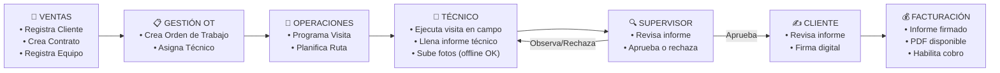
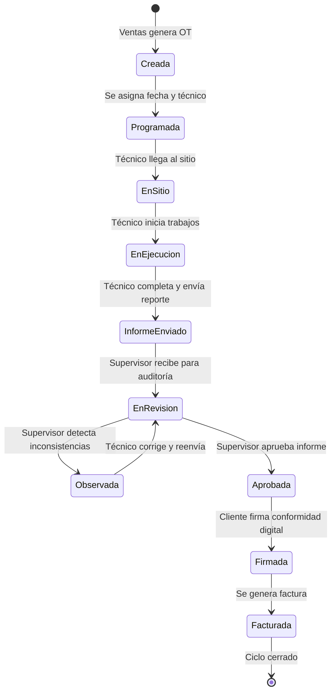
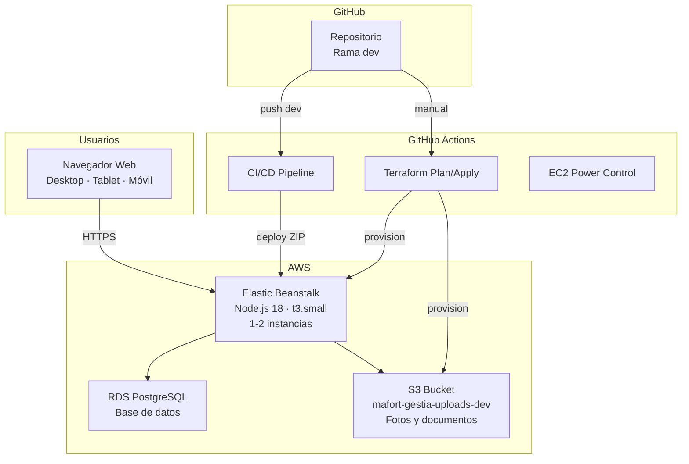

# Análisis Funcional — Gestia v4.0
## Sistema de Gestión de Mantenimiento — Mafort Service S.A.C.

> **Versión del documento**: 1.0 — 11 de Agosto de 2026
> **Propósito**: Análisis funcional completo para servir como base de un **Manual de Usuario**.
> **Aplicación**: Gestia — Plataforma Web de Gestión de Órdenes de Trabajo y Reportes Técnicos

---

## Tabla de Contenido

1. [Información General del Sistema](#1-información-general-del-sistema)
2. [Arquitectura del Flujo de Trabajo](#2-arquitectura-del-flujo-de-trabajo)
3. [Módulos Funcionales](#3-módulos-funcionales)
   - 3.1 [Pantalla de Login](#31-pantalla-de-login)
   - 3.2 [Dashboard (Panel Principal)](#32-dashboard-panel-principal)
   - 3.3 [Comercial — CRM](#33-comercial--crm)
   - 3.4 [Gestión de OTs (SLA)](#34-gestión-de-ots-sla)
   - 3.5 [Operaciones](#35-operaciones)
   - 3.6 [Inventario de Equipos](#36-inventario-de-equipos)
   - 3.7 [Portal del Técnico de Campo](#37-portal-del-técnico-de-campo)
   - 3.8 [Portal de Supervisión](#38-portal-de-supervisión)
   - 3.9 [Portal Ventas](#39-portal-ventas)
   - 3.10 [Portal del Cliente (Firmas)](#310-portal-del-cliente-firmas)
   - 3.11 [Administración](#311-administración)
4. [Formato del Documento Corporativo](#4-formato-del-documento-corporativo)
5. [Modelo de Datos](#5-modelo-de-datos)
6. [API del Sistema](#6-api-del-sistema)
7. [Funcionalidades Transversales](#7-funcionalidades-transversales)
8. [Infraestructura y Despliegue](#8-infraestructura-y-despliegue)
9. [Seguridad](#9-seguridad)
10. [Matriz de Acceso por Rol](#10-matriz-de-acceso-por-rol)
11. [Estado Actual del Desarrollo](#11-estado-actual-del-desarrollo)
12. [Glosario de Términos](#12-glosario-de-términos)

---

## 1. Información General del Sistema

### 1.1 ¿Qué es Gestia?

**Gestia** es una plataforma web de nivel empresarial desarrollada para **Mafort Service S.A.C.**, empresa peruana especializada en la venta y prestación de servicios de mantenimiento (preventivo, correctivo, de emergencia, instalación y diagnóstico) para equipamiento de soporte crítico de infraestructura de TI.

La aplicación digitaliza y automatiza **el ciclo de vida completo** de las Órdenes de Trabajo (OT) de mantenimiento, desde la gestión comercial de clientes y contratos, pasando por la ejecución técnica en campo con soporte offline, hasta la firma digital del cliente y la facturación.

### 1.2 Tipos de Equipos Soportados

Gestia maneja **4 categorías principales de equipos** de soporte crítico:

| Tipo de Equipo | Descripción |
|---|---|
| **UPS** | Sistema de alimentación ininterrumpida (monofásico y trifásico) |
| **Climatización de Precisión** | Aire acondicionado de precisión para salas de servidores y data centers |
| **Transformador** | Transformador de potencia eléctrica |
| **Rectificador Industrial** | Convertidor AC/DC industrial |

### 1.3 Problema que Resuelve

| Antes (proceso manual) | Ahora (con Gestia) |
|---|---|
| Fichas técnicas en papel autocopiativo | Formularios digitales desde tablet/móvil con wizard paso a paso |
| Técnicos sin conexión durante 20+ días | Soporte offline completo con auto-guardado y sincronización automática |
| Transcripción manual a Word en oficina | Generación automática de informes DOCX/PDF de 10 páginas |
| Demora de ~30 días para facturar | Flujo digital: campo → revisión → firma → facturación en horas |
| Fotos sueltas en celulares | Registro fotográfico estructurado por potencia kVA con slots etiquetados |
| Sin trazabilidad del proceso | Dashboard con KPIs, pipeline Kanban, alertas SLA y Copiloto IA |
| Sin control de inventario | Catálogo de equipos con historial de servicios y alertas |
| Gestión comercial dispersa | CRM integrado con contratos, adendas y seguimiento |

### 1.4 Usuarios del Sistema

| Rol | Descripción | Módulos Principales |
|---|---|---|
| **Administrador** | Control total del sistema. Gestiona usuarios, roles y configuración | Todos los módulos |
| **Ventas** | Gestiona clientes, contratos comerciales, crea OTs y genera reportes de facturación | Dashboard, Comercial, Gestión OTs, Portal Ventas, Portal Cliente |
| **Técnico** | Ejecuta visitas de mantenimiento en campo, llena reportes técnicos | Dashboard, Portal Técnico, Inventario de Equipos |
| **Supervisor** | Planifica operaciones, revisa y aprueba/rechaza reportes técnicos | Dashboard, Gestión OTs, Operaciones, Inventario, Supervisión |
| **Cliente** | Revisa informes aprobados y firma conformidad digital | Portal Cliente |

### 1.5 Stack Tecnológico

| Capa | Tecnología |
|---|---|
| **Frontend** | React 19 + TypeScript + Vite 6 + Tailwind CSS v4 |
| **Iconografía** | Lucide React |
| **Gráficos** | Recharts (Dashboard) |
| **Animaciones** | Motion (microinteracciones) |
| **Tour Guiado** | Driver.js (onboarding interactivo) |
| **Backend** | Node.js 20 + Express 4 + TypeScript |
| **Base de Datos** | PostgreSQL 15 (vía Prisma ORM 7) |
| **Almacenamiento Fotos** | AWS S3 (con fallback local en `uploads/`) |
| **Autenticación** | JWT (JSON Web Tokens) + bcryptjs |
| **Generación Documentos** | `docx` (Word) + Puppeteer (PDF) |
| **IA** | Google Gemini (`@google/genai`) — Copiloto IA del Dashboard |
| **Offline** | Service Workers + IndexedDB (`idb`) + PWA (`vite-plugin-pwa`) |
| **Infraestructura** | AWS Elastic Beanstalk + S3 + RDS PostgreSQL |
| **IaC** | Terraform |
| **CI/CD** | GitHub Actions (auto-deploy al push en `dev`) |
| **Testing** | Playwright (E2E con grabación de video) |

---

## 2. Arquitectura del Flujo de Trabajo

### 2.1 Flujo Principal de Negocio (End-to-End)



### 2.2 Ciclo de Vida de una Orden de Trabajo (10 estados)



| Estado | Código | Significado |
|---|---|---|
| Creada | `CREADA` | OT generada, pendiente de programar |
| Pendiente Programación | `PENDIENTE_PROGRAMACION` | OT requiere asignación de fecha y técnico |
| Asignada | `ASIGNADA` | Técnico asignado, fecha por confirmar |
| Programada | `PROGRAMADA` | Fecha, hora y técnico confirmados |
| En Camino | `EN_CAMINO` | Técnico en tránsito hacia el sitio |
| En Sitio | `EN_SITIO` | Técnico llegó a las instalaciones del cliente |
| Trabajo en Ejecución | `TRABAJO_EN_EJECUCION` | Técnico ejecutando el mantenimiento |
| No Ejecutada | `NO_EJECUTADA` | La OT no pudo ejecutarse (acceso denegado, equipo no disponible, etc.) |
| Informe Pendiente | `INFORME_PENDIENTE` | Trabajo completado, reporte por llenar |
| Informe Enviado | `INFORME_ENVIADO` | Técnico completó y envió el reporte |
| En Revisión | `EN_REVISION` | Supervisor revisando el informe |
| Observada | `OBSERVADA` | Supervisor rechazó con notas de corrección |
| Corregida | `CORREGIDA` | Técnico corrigió observaciones, re-enviado |
| Aprobada | `APROBADA` | Supervisor aprobó, listo para firma del cliente |
| Firmada | `FIRMADA` | Cliente firmó conformidad digital |
| Facturada | `FACTURADA` | Se generó la factura del servicio |
| Cerrada | `CERRADA` | Proceso completamente terminado |

### 2.3 Ciclo de Vida de una Visita (6 estados)

| Estado | Significado |
|---|---|
| Planificada | Visita agendada para una fecha futura |
| Confirmada | Cliente confirmó la visita |
| En Ruta | Técnico en camino al sitio |
| En Sitio | Técnico presente en las instalaciones |
| Completada | Visita finalizada exitosamente |
| Cancelada | Visita cancelada |

---

## 3. Módulos Funcionales

### 3.1 Pantalla de Login

> **Acceso**: Todos los usuarios
> **Categoría**: Entrada al sistema

#### Descripción
Punto de entrada único al sistema. El usuario se autentica con su correo corporativo y contraseña.

#### Funcionalidades
- **Formulario de autenticación**: Correo electrónico + contraseña con validación
- **Visibilidad de contraseña**: Toggle para mostrar/ocultar
- **"Recordarme"**: Persiste la sesión en localStorage del navegador
- **Mensajes de error**: Descriptivos para credenciales inválidas o usuario suspendido
- **Indicador de carga**: Spinner durante la autenticación
- **Redirección automática**: Si ya existe sesión activa, va directo al Dashboard
- **Diseño**: Fondo animado con gradiente, branding Mafort, 100% responsivo

#### Flujo de Autenticación
1. El usuario ingresa correo y contraseña
2. El sistema envía las credenciales al servidor (`POST /api/login`)
3. El servidor valida con bcrypt contra la base de datos
4. Si el usuario está `Suspendido` → error, no se permite acceso
5. Si las credenciales son válidas → genera JWT (24 horas de vigencia) → retorna token + datos del usuario
6. El frontend almacena el token y redirige al Dashboard
7. Si las credenciales son inválidas → muestra mensaje de error

---

### 3.2 Dashboard (Panel Principal)

> **Acceso**: Administrador, Ventas, Supervisor, Técnico
> **Módulo**: `dashboard`
> **Categoría**: Core

#### Descripción
Centro de comando y control con métricas en tiempo real. Se adapta dinámicamente según el rol del usuario autenticado, mostrando KPIs, pipeline de OTs, alertas y un copiloto de inteligencia artificial.

#### Componentes del Dashboard

##### 3.2.1 Encabezado Dinámico (`DashboardHeader`)
- Saludo personalizado según el rol del usuario
- Resumen rápido de KPIs en línea
- Indicador de fecha y hora actual

##### 3.2.2 Tarjetas KPI (`KpiGrid`)
Grilla de tarjetas con métricas clave que varían según el rol:

| KPI (ejemplo) | Descripción |
|---|---|
| **Total OTs** | Cantidad total de órdenes de trabajo |
| **OTs Activas** | Órdenes actualmente en ejecución |
| **OTs Pendientes** | Órdenes pendientes de asignar o ejecutar |
| **Informes Pendientes** | Reportes técnicos por revisar |
| **Cumplimiento SLA** | Porcentaje de órdenes dentro del SLA contractual |

##### 3.2.3 Pipeline de OTs (`PipelineOTs`)
- Vista **Kanban** que muestra la distribución de OTs por estado
- Columnas por cada estado del ciclo de vida
- Tarjetas resumidas con código OT, cliente y técnico
- Actualización en tiempo real

##### 3.2.4 Alertas de Riesgo (`RiskAlerts`)
- Notificaciones de OTs que se acercan o exceden el SLA
- Alertas de equipos con mantenimiento vencido
- Indicadores de prioridad (alta, media, baja)

##### 3.2.5 Actividad Reciente (`RecentActivity`)
- Feed/timeline de las últimas acciones en el sistema
- Quién hizo qué y cuándo (creaciones, aprobaciones, firmas)

##### 3.2.6 Carga de Técnicos (`CargaTecnicos`)
- Distribución de carga de trabajo por técnico
- OTs asignadas vs completadas por persona

##### 3.2.7 Cumplimiento SLA (`CumplimientoChart`)
- Gráfico de cumplimiento de SLA por período
- Porcentaje de OTs completadas dentro del plazo contractual

##### 3.2.8 Ranking de Equipos con Fallas (`RankingEquiposFallas`)
- Top de equipos con mayor incidencia de fallas
- Útil para decisiones de reemplazo o mantenimiento intensivo

##### 3.2.9 Copiloto IA (`CopilotoIAPanel`)
- **Tecnología**: Integrado con Google Gemini (`@google/genai`)
- **Funcionalidad**: Panel de lenguaje natural para consultar datos del sistema
- **Uso**: El usuario puede hacer preguntas como:
  - "¿Cuántas OTs tiene pendientes el técnico Carlos?"
  - "¿Qué contratos vencen este mes?"
  - "Resumen de la semana de mantenimiento"
- **Respuestas**: El copiloto procesa las consultas y genera respuestas contextualizadas con los datos reales del sistema

---

### 3.3 Comercial — CRM

> **Acceso**: Administrador, Ventas
> **Módulo**: `comercial`
> **Categoría**: Comercial

#### Descripción
Módulo CRM (Customer Relationship Management) para la gestión de la cartera de clientes, contratos comerciales y adendas contractuales.

#### 3.3.1 Gestión de Clientes

##### Listado de Clientes
- Tabla con columnas: Razón Social, RUC, Nombre Comercial, Sector Económico, País/Provincia/Distrito, Dirección, Contacto, Estado
- Filtros por sector económico, geografía y estado
- Búsqueda por texto (razón social, RUC)
- Acciones por fila: Editar, Desactivar, Ver contratos

##### Formulario de Crear/Editar Cliente
| Campo | Tipo | Validación | Obligatorio |
|---|---|---|---|
| Razón Social | Texto | Mínimo 3 caracteres | ✅ |
| RUC | Texto | Exactamente 11 dígitos numéricos | ✅ |
| Tipo de Documento | Selector | RUC, DNI, etc. | ✅ |
| Nombre Comercial | Texto | — | ❌ |
| País | Selector (Ubigeo) | Lista de países | ✅ |
| Provincia | Selector (Ubigeo) | Se filtra según país seleccionado | ✅ |
| Distrito | Selector (Ubigeo) | Se filtra según provincia seleccionada | ✅ |
| Dirección | Texto | — | ✅ |
| Sector Económico | Selector | Minería, Telecomunicaciones, Banca, etc. | ❌ |
| Contacto — Nombre | Texto | — | ✅ |
| Contacto — Email | Email | Formato email válido | ✅ |
| Contacto — Teléfono | Texto | — | ❌ |

> [!NOTE]
> El sistema utiliza una base de datos **Ubigeo** (País → Provincia → Distrito) con selectores en cascada para la geolocalización precisa de los clientes.

#### 3.3.2 Gestión de Contratos Comerciales

##### Listado de Contratos
- Tabla con: Código, Cliente, Tipo de Contrato, Monto Total, Moneda, Fecha Inicio/Fin, Estado, Equipos Vinculados

##### Formulario de Crear/Editar Contrato
| Campo | Tipo | Obligatorio |
|---|---|---|
| Cliente | Selector con búsqueda | ✅ |
| Código de Contrato | Texto | ✅ |
| Tipo de Contrato | Selector | ✅ |
| Fecha de Inicio | Fecha | ✅ |
| Fecha de Fin | Fecha | ✅ |
| Monto Total | Numérico | ✅ |
| Moneda | Selector (PEN/USD) | ✅ |
| Equipos Vinculados | Selector múltiple | ❌ |

##### Vinculación de Equipos
- Los contratos se pueden vincular a equipos registrados en el inventario
- Un contrato puede cubrir múltiples equipos

#### 3.3.3 Adendas Contractuales (Ampliaciones)

Para modificaciones o extensiones de contratos existentes:

| Campo | Tipo | Descripción |
|---|---|---|
| Contrato Original | Selector | Contrato al que se asocia la adenda |
| Número de Adenda | Numérico | Correlativo de la ampliación |
| Motivo | Texto | Razón de la ampliación |
| Monto Adicional | Numérico | Monto incremental |
| Fechas | Fecha inicio/fin | Período de la adenda |
| Equipos Adicionales | Selector múltiple | Nuevos equipos cubiertos |

---

### 3.4 Gestión de OTs (SLA)

> **Acceso**: Administrador, Ventas, Supervisor
> **Módulo**: `gestion-ots`
> **Categoría**: Operaciones

#### Descripción
Módulo central para la creación, programación y seguimiento de las Órdenes de Trabajo con monitoreo de cumplimiento de SLA (Service Level Agreement).

#### Funcionalidades

##### Vistas de OTs
El módulo ofrece dos modos de visualización:
- **Vista Tabla**: Tabla detallada con todas las columnas, filtros y ordenamiento
- **Vista Kanban**: Tarjetas organizadas por columnas de estado (pipeline visual)

##### Listado/Tabla de OTs
| Columna | Descripción |
|---|---|
| Código | Identificador único (ej: `OT-4101`) |
| Cliente | Razón social del cliente |
| Tipo de Equipo | Categoría del equipo mantenido |
| Tipo de Servicio | Preventivo, Correctivo, Emergencia, Instalación, Diagnóstico |
| Potencia (kVA) | Capacidad del equipo |
| Fecha Programada | Fecha de la visita planificada |
| Técnico Titular | Técnico asignado principal |
| Estado | Badge de color con el estado actual |
| SLA | Indicador de cumplimiento del plazo |
| Acciones | Editar, Eliminar, Ver reporte |

##### Formulario de Crear OT
| Campo | Tipo | Opciones | Obligatorio |
|---|---|---|---|
| Cliente | Selector con búsqueda | Clientes activos | ✅ |
| Contrato | Selector | Contratos activos del cliente | ❌ |
| Equipo | Selector | Equipos del cliente (del inventario) | ❌ |
| Tipo de Servicio | Selector | Preventivo, Predictivo, Correctivo, Instalación, Visita Técnica, Cambio de Baterías, Pruebas Fault-Over, Apagado/Encendido, Revisión/Diagnóstico, Emergencia | ✅ |
| Potencia (kVA) | Numérico | — | ✅ |
| Fecha Programada | Fecha | — | ✅ |
| Hora Programada | Hora | — | ❌ |
| Técnico Titular | Selector | Usuarios con rol Técnico | ✅ |
| Técnico de Apoyo | Selector | Usuarios con rol Técnico | ❌ |

##### Líneas Financieras de la OT (`OrdenTrabajoLinea`)
Cada OT puede contener líneas de detalle financiero para facturación:

| Campo | Descripción |
|---|---|
| Descripción | Concepto del servicio/repuesto |
| Cantidad | Unidades |
| Precio Unitario | Precio por unidad |
| Subtotal | Calculado automáticamente |
| Moneda | PEN o USD |

##### Lógica de Negocio
- Al crear una OT, se auto-genera un código correlativo `OT-XXXX`
- Se pre-cargan datos del cliente seleccionado
- La OT puede vincularse opcionalmente a un contrato y equipo específico
- El sistema calcula cumplimiento SLA según la fecha programada vs actual
- Solo se puede eliminar una OT en estados iniciales

---

### 3.5 Operaciones

> **Acceso**: Administrador, Supervisor
> **Módulo**: `operaciones`
> **Categoría**: Operaciones

#### Descripción
Módulo para la planificación de visitas técnicas y la asignación de técnicos a rutas de trabajo.

#### 3.5.1 Gestión de Visitas

Una **Visita** agrupa una o más OTs que un técnico ejecutará en una misma jornada o desplazamiento.

##### Listado de Visitas
- Tabla con: Título, Fecha Programada, Técnico(s), Cliente, Estado, Cantidad de OTs

##### Formulario de Crear/Editar Visita
| Campo | Tipo | Obligatorio |
|---|---|---|
| Título | Texto | ✅ |
| Fecha Programada | Fecha | ✅ |
| Técnico(s) | Selector múltiple | ✅ |
| Cliente | Selector | ✅ |
| OTs a incluir | Selector múltiple | ✅ |
| Notas | Texto | ❌ |

##### Seguimiento de Estado
Las visitas pasan por los estados: Planificada → Confirmada → En Ruta → En Sitio → Completada (o Cancelada)

#### 3.5.2 Monitor de Técnicos (`TechMonitoringDashboard`)

Panel de monitoreo en tiempo real de los técnicos en campo:

| Elemento | Descripción |
|---|---|
| **Tarjetas de Técnicos** | Una tarjeta por cada técnico activo con su estado actual |
| **Estado del Técnico** | En Ruta, En Sitio, En Ejecución, Disponible, Offline |
| **OT Actual** | La OT que el técnico está ejecutando en este momento |
| **Carga de Trabajo** | Cantidad de OTs asignadas/pendientes |
| **Actividad Reciente** | Últimas acciones del técnico |

---

### 3.6 Inventario de Equipos

> **Acceso**: Administrador, Ventas, Supervisor, Técnico
> **Módulo**: `inventario-equipos`
> **Categoría**: Operaciones
> **Badge**: 🆕 Nuevo

#### Descripción
Catálogo completo de todos los equipos que Mafort mantiene, con historial de servicios y alertas de próximo mantenimiento.

#### Funcionalidades

##### Catálogo de Equipos
| Campo | Descripción |
|---|---|
| Tipo de Equipo | Categoría (UPS, Transformador, Banco de Baterías, Estabilizador) |
| Marca | Fabricante |
| Modelo | Modelo específico |
| Serie | Número de serie único |
| Potencia (kVA) | Capacidad del equipo |
| Cliente | Empresa propietaria |
| Ubicación | Sede / Piso / Área específica |
| Estado Operativo | Operativo, En reparación, En observación, Baja, En almacén |
| Fecha de Instalación | Cuándo fue instalado |
| Último Servicio | Fecha del último mantenimiento |
| Próximo Servicio | Fecha estimada del próximo servicio |

##### Historial de Servicios por Equipo
Para cada equipo se registra un timeline de servicios realizados:

| Campo | Descripción |
|---|---|
| Tipo de Servicio | Preventivo, Correctivo, etc. |
| Fecha | Fecha del servicio |
| Código OT | Código de la OT asociada |
| Técnico | Quién realizó el servicio |
| Resultado | Éxito, Pendiente, Requiere seguimiento |
| Observaciones | Notas del técnico |

##### Alertas
- Equipos con servicio vencido (fecha de próximo servicio pasada)
- Equipos próximos a requerir mantenimiento (próximas 2 semanas)
- Equipos fuera de servicio

##### Filtros y Búsqueda
- Por tipo de equipo, marca, cliente, estado operativo
- Búsqueda por serie, modelo o ubicación

---

### 3.7 Portal del Técnico de Campo

> **Acceso**: Administrador, Técnico
> **Módulo**: `tecnico`
> **Categoría**: Campo

#### Descripción
El módulo más extenso y complejo del sistema. Portal especializado para que los técnicos ejecuten sus visitas de mantenimiento y completen los reportes técnicos en campo, con soporte completo para trabajo sin conexión a internet.

#### 3.7.1 Bandeja de Trabajo

##### Vista de Visitas Asignadas
- Lista de visitas programadas para el técnico autenticado
- Indicadores de estado (Planificada, Confirmada, En Ruta, En Sitio)
- Botones de acción: Iniciar Ruta, Llegar a Sitio
- Cada visita muestra las OTs asociadas

##### Vista de OTs Asignadas
- Lista de OTs pendientes de ejecución
- Filtro por estado (Programada, En Ejecución, Observada)
- Indicadores de prioridad y SLA
- Clic en una OT abre el formulario de reporte

#### 3.7.2 Wizard del Informe Técnico (`WizardInforme`)

El formulario de reporte técnico se presenta como un **wizard (asistente paso a paso)** de **10 pasos organizados en 4 secciones**, con indicador de progreso, validación por paso, auto-guardado continuo a IndexedDB (cada 1.5 segundos) y generación de vista previa PDF en tiempo real.

**Secciones del Wizard**:
1. **Datos del Servicio** (pasos 1-2)
2. **Trabajo Realizado** (pasos 3-5)
3. **Inspección Técnica** (pasos 6-8)
4. **Diagnóstico y Envío** (pasos 9-10)

---

##### Paso 1: Datos Generales del Servicio

| Campo | Tipo | Descripción |
|---|---|---|
| Informe N° | Texto | Código correlativo del reporte oficial |
| Hoja de Servicio N° | Texto | Correlativo del documento físico |
| Asunto | Texto | Tema del servicio (ej: "Mantenimiento Preventivo UPS 40kVA") |
| Fecha del Servicio | Fecha | Fecha de la visita |
| Hora de Inicio | Hora | Hora de inicio de trabajos |
| Técnico 1 (Titular) | Texto | Nombre del técnico principal (pre-llenado) |
| Técnico 2 (Apoyo) | Texto | Nombre del técnico de apoyo (opcional) |

##### Paso 2: Antecedentes

- Área de texto amplia para la narrativa formal de antecedentes del servicio
- Template Mafort pre-rellenado disponible que describe el contexto corporativo del cliente y el motivo de la visita
- El técnico puede editar o reemplazar el texto predefinido

##### Paso 3: Acciones Realizadas (Checklist de 24 acciones estándar)

Grid de checkboxes con las **24 acciones de mantenimiento estándar** de Mafort. El técnico marca las acciones ejecutadas durante la visita:

| # | Acción Ejemplo |
|---|---|
| 1 | Inspección visual del equipo |
| 2 | Limpieza externa del gabinete |
| 3 | Sopleteado de componentes internos |
| 4 | Limpieza de filtros de aire |
| 5 | Verificación de conexiones y borneras |
| 6 | Torque de terminales |
| 7 | Medición de voltaje de entrada |
| 8 | Medición de voltaje de salida |
| 9 | Verificación de carga |
| 10 | Prueba de transferencia a bypass |
| 11 | Prueba de baterías |
| 12 | Medición de resistencia interna de baterías |
| 13 | Verificación de alarmas del sistema |
| 14 | Revisión de display/panel de control |
| 15 | Verificación de ventiladores |
| 16-24 | Acciones adicionales de mantenimiento especializado |

##### Paso 4: Procedimiento por Pasos (6 pasos cronológicos)

| Paso | Descripción | Campos Específicos |
|---|---|---|
| **1** | Verificación del estado del equipo | ¿Equipo encendido? (sí/no), Modo de funcionamiento (inversor/bypass/apagado), Tipo de bypass (interno/externo/no aplica) |
| **2** | Procedimiento de des-energización | Descripción del procedimiento seguido |
| **3** | Limpieza y mantenimiento físico | Detalle de trabajos realizados |
| **4** | Re-energización del equipo | Procedimiento de puesta en marcha |
| **5** | Verificación de parámetros | Confirmación de lecturas post-mantenimiento |
| **6** | Conclusión del servicio | ¿Servicio concluido? (sí/no), Observaciones finales |

##### Paso 5: Características Técnicas del Equipo

Matriz de **30+ especificaciones técnicas** como pares clave-valor:

| Categoría | Campos Ejemplo |
|---|---|
| **Identificación** | Marca, Modelo, Serie, Potencia nominal (kVA) |
| **Eléctricos** | Voltaje nominal entrada, Voltaje nominal salida, Frecuencia, Número de fases |
| **Baterías** | Tipo, Cantidad de celdas, Voltaje por celda, Año de fabricación |
| **Ambiente** | Temperatura de sala, Humedad relativa, ¿Ambiente hermético? |
| **Infraestructura** | Tipo de gabinete (Rack/Torre), Aire acondicionado dedicado, Piso técnico |

##### Paso 6: Registro Fotográfico

> [!IMPORTANT]
> La cantidad mínima de fotografías obligatorias varía según la potencia del equipo (SLA contractual). El sistema calcula dinámicamente los slots de fotos requeridos.

| Potencia kVA | Fotos Mínimas | Contenido Típico |
|---|---|---|
| 1 kVA | 6 fotos | Estado general, sopladores, conexiones básicas |
| 10 kVA | 8 fotos | Borneras, limpieza con brocha, componentes internos |
| 20 kVA | 14 fotos | Placas de baterías (RT1290), celdas, vistas cruzadas |
| 40 kVA | 16 fotos | Bypass de maniobras, transformador de aislamiento |
| 80 kVA | 16 fotos | Auditoría completa, módulos de potencia |
| 160 kVA | 20 fotos | Desmontaje de módulos, resistencia interna de packs |

Cada slot de foto incluye:
- **Etiqueta descriptiva** (ej: "Vista frontal del equipo", "Estado de borneras R-S-T")
- **Zona de carga**: Arrastrar y soltar (drag & drop) o captura directa desde cámara
- **Vista previa** en miniatura con opción de eliminar
- **Subida**: A AWS S3 automáticamente (o local como fallback)

##### Paso 7: Mediciones Eléctricas

Dos matrices de entrada para registrar parámetros eléctricos trifásicos:

**Mediciones de Entrada (Red Eléctrica)**:
| Parámetro | Fase R | Fase S | Fase T |
|---|---|---|---|
| Voltaje Línea-Neutro (V) | campo | campo | campo |
| Voltaje Línea-Línea (V) | campo | campo | campo |
| Intensidad de Corriente (A) | campo | campo | campo |
| Frecuencia (Hz) | campo | campo | campo |

**Mediciones de Salida (Regulada por el Equipo)**:
| Parámetro | Fase R | Fase S | Fase T |
|---|---|---|---|
| Voltaje Línea-Neutro (V) | campo | campo | campo |
| Voltaje Línea-Línea (V) | campo | campo | campo |
| Intensidad de Corriente (A) | campo | campo | campo |
| Frecuencia (Hz) | campo | campo | campo |

##### Paso 8: Diagnóstico y Normas

**Diagnóstico de Gabinete**:
| Campo | Opciones |
|---|---|
| ¿Cuenta con gabinete dedicado? | Sí / No |
| Tipo de estructura | Modo Rack / Torre / No aplica |
| ¿Equipo en bypass? | Sí / No / Apagado |

**Revisión de Normas**:
| Campo | Tipo |
|---|---|
| ¿Mantenimiento realizado completamente? | Sí/No |
| Año de las baterías | Numérico |
| ¿Ambiente hermético? | Sí/No |
| Temperatura de sala (°C) | Numérico |
| ¿Equipo en estado operativo? | Sí/No |
| Inversor operando al (%) | Numérico (0-100) |

##### Paso 9: Recomendaciones

- Lista editable de recomendaciones técnicas de seguridad y mantenimiento
- Botón para **agregar** nueva recomendación
- Botón para **eliminar** recomendación existente
- **Sugerencias pre-escritas** (templates Mafort):
  - Mantener temperatura de sala entre 18°C y 21°C constantemente
  - Instalar tablero Micro P.O.D para distribución eléctrica
  - Renovar banco de baterías (vida útil de 3-5 años)
  - Implementar sistema de monitoreo remoto 24/7
  - Programar mantenimientos preventivos trimestrales
  - Mantener bitácora de incidentes eléctricos

---

#### 3.7.3 Asistente Inteligente Mafort (Auto-llenado)

Función especial de productividad que permite al técnico **auto-completar el reporte completo** con un solo clic, generando datos consistentes y profesionales:

| Qué auto-llena | Detalle |
|---|---|
| Datos generales | Números correlativos, fechas, nombres de técnicos |
| Antecedentes | Texto narrativo profesional basado en el tipo de equipo |
| Acciones realizadas | Marcado según el tipo de mantenimiento |
| Procedimiento | 6 pasos con descripciones estándar |
| Características | Especificaciones típicas del tipo y potencia de equipo |
| Fotos | Imágenes de prueba coherentes con la potencia kVA |
| Mediciones | Valores típicos para el tipo de equipo |
| Diagnóstico | Valores estándar |
| Recomendaciones | Lista pre-configurada por tipo de servicio |

> [!TIP]
> El auto-llenado es especialmente útil para demostraciones al cliente final y para testing. En campo, el técnico lo usa como punto de partida y ajusta los valores reales.

#### 3.7.4 Soporte Offline Completo

| Característica | Detalle |
|---|---|
| **Detección de red** | Monitoreo automático del estado de conexión del dispositivo |
| **Indicador visual** | Badge "Offline" / "Online" visible en todo momento |
| **Auto-guardado** | Cada 1.5 segundos el informe se guarda automáticamente en IndexedDB |
| **Persistencia** | Los datos se mantienen aunque se cierre el navegador o se apague el dispositivo |
| **Cola de sincronización** | Las operaciones pendientes se encolan automáticamente |
| **Sincronización automática** | Al detectar conexión, se sincronizan todos los datos pendientes |
| **Reintentos** | Estrategia de backoff exponencial para reintentos de sincronización |
| **Pre-carga** | Los datos de equipos se cachean para uso offline |
| **Flag `offlineDirty`** | Los reportes guardados offline se marcan para sincronización posterior |

> [!NOTE]
> El soporte offline es crítico porque los técnicos trabajan frecuentemente en salas de servidores herméticas, sótanos o ubicaciones remotas donde no hay señal celular ni Wi-Fi.

#### 3.7.5 Envío para Revisión

- Botón **"Enviar a Revisión"** disponible cuando el reporte está completo
- **Validaciones antes del envío**:
  - ✅ Cantidad mínima de fotos cumplida según potencia kVA
  - ✅ Campos obligatorios completados
  - ✅ Acciones principales marcadas
- Al enviar exitosamente: estado de la OT cambia a `INFORME_ENVIADO` → `EN_REVISION`
- El reporte aparece automáticamente en la bandeja del Supervisor

---

### 3.8 Portal de Supervisión

> **Acceso**: Administrador, Supervisor
> **Módulo**: `supervision`
> **Categoría**: Calidad

#### Descripción
Portal de auditoría y control de calidad donde los supervisores técnicos evalúan los reportes enviados por los técnicos de campo.

#### Funcionalidades

##### Cola de Revisión
- Tabla de OTs en estado `EN_REVISION` u `OBSERVADA`
- Columnas: Código OT, Cliente, Equipo, Técnico, Fecha de envío, Estado
- Ordenadas por antigüedad (primero los más antiguos)

##### Vista Detallada del Reporte
El supervisor puede ver el informe completo en dos modos:
- **Vista Resumen**: Datos principales, fotos y mediciones
- **Vista PDF Simulada**: Previsualización exacta del documento de 10 páginas tal como se imprimirá

Los 9 pasos del informe son visibles en modo de solo lectura:
- Datos generales, antecedentes, acciones realizadas
- Procedimiento por pasos, características técnicas
- Galería de fotos con etiquetas
- Tablas de mediciones eléctricas
- Diagnóstico, normas, recomendaciones

##### Acciones del Supervisor

| Acción | Botón | Efecto |
|---|---|---|
| **Aprobar** | "Aprobar Reporte" (verde) | OT → `APROBADA`. El informe pasa al Portal Cliente para firma |
| **Observar/Rechazar** | "Observar con Correcciones" (rojo) | OT → `OBSERVADA`. Se abre campo para escribir notas de corrección visibles por el técnico |

##### Generación de Documentos
| Formato | Descripción |
|---|---|
| **DOCX (Word)** | Descarga documento Word editable con formato corporativo Mafort completo, incluyendo fotos incrustadas |
| **PDF** | Descarga documento PDF de alta fidelidad renderizado servidor (Puppeteer) |

##### Historial de Correcciones
- Si un reporte fue observado previamente, se muestra el historial de notas de corrección
- Timestamps de cada cambio de estado para trazabilidad

---

### 3.9 Portal Ventas

> **Acceso**: Administrador, Ventas
> **Módulo**: `ventas`
> **Categoría**: Comercial

#### Descripción
Portal orientado al seguimiento comercial, generación de reportes y gestión de facturación.

#### Funcionalidades
- Generación y descarga de reportes PDF/DOCX para clientes
- Seguimiento de OTs por estado de facturación
- Código de OT correlativo con mapeo a contratos/adendas (`getNextOtCode`)
- Resumen estadístico de servicios ejecutados vs pendientes

---

### 3.10 Portal del Cliente (Firmas)

> **Acceso**: Administrador, Ventas, Supervisor, Cliente
> **Módulo**: `cliente`
> **Categoría**: Externo

#### Descripción
Portal donde el cliente final revisa el informe técnico aprobado y estampa su firma digital de conformidad, cerrando el ciclo del servicio.

#### Funcionalidades

##### Lista de OTs para Firmar
- OTs en estado `APROBADA` listas para firma del cliente
- Cada ítem muestra: código OT, fecha del servicio, equipo, técnico

##### Previsualización del Informe
- Renderizado completo del informe corporativo de 10 páginas
- Vista idéntica al documento final impreso
- Todas las secciones en modo de solo lectura

##### Pizarra de Firma Digital (Canvas HTML5)

| Característica | Detalle |
|---|---|
| **Tecnología** | Canvas HTML5 con soporte multi-touch |
| **Color de tinta** | Azul marino profundo (#1a237e) — tinta reglamentaria Mafort |
| **Trazo** | Suavizado con algoritmo de pincel estilizado |
| **Dispositivos** | Dedo en pantalla táctil (móvil/tablet), stylus, mouse |
| **Acciones** | Limpiar firma, Rehacer |
| **Captura** | Se almacena como imagen Base64 PNG |
| **Inmutabilidad** | Una vez firmado, el canvas se bloquea permanentemente |

##### Flujo de Firma
1. El cliente visualiza la lista de informes pendientes de firma
2. Selecciona un informe y lo revisa completamente
3. Firma con el dedo o stylus en el canvas
4. Clic en **"Firmar y Conformar"**
5. El sistema captura la firma y la asocia al reporte
6. OT cambia a estado `FIRMADA`
7. Se habilita la descarga del PDF final con la firma incluida

---

### 3.11 Administración

> **Acceso**: Administrador exclusivamente
> **Módulo**: `admin`
> **Categoría**: Sistema

#### Descripción
Panel de administración del sistema para gestionar usuarios, roles y configuración.

#### Gestión de Usuarios

##### Listado de Usuarios
- Tabla con: Nombre, Apellido, Email, Rol, Estado (Activo/Suspendido), Teléfono

##### Formulario de Crear/Editar Usuario
| Campo | Tipo | Obligatorio |
|---|---|---|
| Nombre | Texto | ✅ |
| Apellido | Texto | ✅ |
| Email | Email (único) | ✅ |
| Contraseña | Password (mín. 6 caracteres) | ✅ (solo al crear) |
| Teléfono | Texto | ❌ |
| Rol | Selector: Administrador, Ventas, Técnico, Supervisor, Cliente | ✅ |
| Módulos Permitidos | JSON de configuración | ❌ |

##### Gestión de Estado
- **Activar**: Permite al usuario iniciar sesión
- **Suspender**: Bloquea el acceso del usuario sin eliminar sus datos

#### Funciones Administrativas
- **Dump de BD**: Exportar datos del sistema (`GET /api/db-dump`)
- **Wipe Operacional**: Reiniciar datos operativos manteniendo configuración base (con limpieza de S3)
- **Logs del Sistema**: Consultar logs de actividad

---

## 4. Formato del Documento Corporativo

### Motor de Renderizado del Informe de 10 Páginas

Gestia genera automáticamente un informe técnico corporativo de alta fidelidad que replica el formato impreso oficial de Mafort para auditorías internacionales de energía.

El componente `DocumentFormat.tsx` ensambla dinámicamente las páginas usando sub-componentes especializados del directorio `src/components/pdf/`.

#### Estructura del Documento

| Página | Componente | Contenido |
|---|---|---|
| **1** | `PaginaPortada` | Logotipos Mafort cruzados, tarjeta del cliente (razón social, RUC, sede, contacto), fecha del servicio, código OT, tipo de equipo y potencia |
| **2** | `PaginaInformeTecnico` | Número de informe correlativo, hoja de servicio, narrativa formal de antecedentes, grilla de 24 acciones con marcas de verificación (✓) |
| **3-4** | Procedimiento + Características | Cronograma de 6 pasos (des-energización, limpieza, re-energización, verificación), matriz de 30+ especificaciones técnicas del equipo |
| **5-7** | Registro Fotográfico | 2 fotografías por página en proporción 4:3 con etiquetas numeradas, encuadres reglamentarios y marca de agua del código OT |
| **8** | Mediciones Eléctricas | Tablas de entrada/salida (voltaje L-N, voltaje L-L, intensidad, frecuencia por fase R-S-T) + diagnóstico del gabinete |
| **9** | Recomendaciones | Lista exhaustiva de recomendaciones de seguridad y mantenimiento |
| **10** | Firmas de Conformidad | Doble bloque: firma del líder especialista Mafort + firma del representante técnico del cliente |

#### Características del Documento
- **Optimizado para impresión**: CSS `@media print` con saltos de página precisos
- **Proporciones A4**: Dimensiones exactas para impresión
- **Tipografía técnica**: Inter/Sora para encabezados, JetBrains Mono para datos numéricos
- **Branding**: Logotipo Mafort, colores corporativos, marcos con bordes de alta legibilidad
- **Cantidad de páginas de fotos**: Calculada dinámicamente según la potencia kVA del equipo

---

## 5. Modelo de Datos

### 5.1 Diagrama Entidad-Relación

```mermaid
erDiagram
    User ||--o{ OT : "técnico titular"
    User ||--o{ OT : "técnico apoyo"
    User ||--o{ Visita : "asignado"
    Client ||--o{ ContratoNuevo : "tiene"
    Client ||--o{ OT : "solicita"
    Client ||--o{ Equipo : "posee"
    Client ||--o{ Visita : "recibe"
    ContratoNuevo ||--o{ ContratoAmpliacion : "adendas"
    ContratoNuevo ||--o{ Equipo : "cubre"
    Visita ||--o{ OT : "agrupa"
    OT ||--o| TechnicalReport : "genera"
    OT ||--o{ OTLinea : "líneas financieras"
    Equipo ||--o{ ServicioEquipo : "historial"
    Equipo ||--o{ OT : "mantenido en"
    
    User {
        int id PK
        string email UK
        string passwordHash
        string nombre
        string apellido
        string rol
        string estado
        string telefono
        json allowedModules
    }
    
    Client {
        int id PK
        string razonSocial
        string ruc UK
        string tipoDocumento
        string nombreComercial
        int paisId FK
        int provinciaId FK
        int distritoId FK
        string direccion
        string contactoNombre
        string contactoEmail
        string sectorEconomico
        string estado
    }
    
    ContratoNuevo {
        int id PK
        int clienteId FK
        string codigo UK
        string tipo
        date fechaInicio
        date fechaFin
        float montoTotal
        string moneda
        string estado
    }
    
    ContratoAmpliacion {
        int id PK
        int contratoOriginalId FK
        int numero
        string motivo
        float montoAdicional
        date fechaInicio
        date fechaFin
        string estado
    }
    
    Visita {
        int id PK
        string titulo
        date fechaProgramada
        int clienteId FK
        string estado
        string notas
    }
    
    OT {
        int id PK
        string codigo UK
        int visitaId FK
        int clienteId FK
        int contratoId FK
        int equipoId FK
        string tipoServicio
        string estado
        int tecnicoId FK
        int tecnicoApoyoId FK
        date fechaProgramada
    }
    
    OTLinea {
        int id PK
        int otId FK
        string descripcion
        int cantidad
        float precioUnitario
        float subtotal
        string moneda
    }
    
    TechnicalReport {
        int id PK
        int otId FK_UK
        float voltajeEntrada
        float voltajeSalida
        json accionesRealizadas
        json pasos
        json caracteristicas
        json fotosLabeled
        json medicionesEntrada
        json medicionesSalida
        json diagnosticoGabinete
        json revisionNormas
        json recomendaciones
        string firmaCliente
        boolean offlineDirty
    }
    
    Equipo {
        int id PK
        int clienteId FK
        int contratoId FK
        string tipoEquipo
        string marca
        string modelo
        string serie UK
        float potenciaKva
        string ubicacion
        string estadoOperativo
        date fechaInstalacion
        date proximoServicio
    }
    
    ServicioEquipo {
        int id PK
        int equipoId FK
        string tipoServicio
        date fecha
        string otCodigo
        string tecnico
        string resultado
        string observaciones
    }
```

### 5.2 Entidades de Soporte

| Entidad | Descripción |
|---|---|
| **Pais** | Catálogo de países (ubigeo) |
| **Provincia** | Provincias por país (ubigeo) |
| **Distrito** | Distritos por provincia (ubigeo) |
| **TipoContrato** | Catálogo de tipos de contrato |
| **TargetVenta** | Metas de venta por período |
| **UserActivityLog** | Log de actividad de usuarios |
| **SyncQueue** | Cola de sincronización offline (entityType, action, payload, status, retries) |

---

## 6. API del Sistema

### 6.1 Catálogo de Endpoints (40+)

#### Autenticación y Sistema
| Método | Endpoint | Descripción |
|---|---|---|
| POST | `/api/login` | Autenticación con email/password, retorna JWT |
| GET | `/api/health` | Verificación de salud del servidor |
| GET | `/api/db-dump` | Exportación de datos (admin) |
| POST | `/api/admin/wipe-operational-db` | Reset operacional + limpieza S3 (admin) |
| GET/POST | `/api/logs` | Consulta/registro de logs |

#### Usuarios
| Método | Endpoint | Descripción |
|---|---|---|
| GET | `/api/users` | Listar usuarios (filtro por rol) |
| POST | `/api/users` | Crear usuario |
| PUT | `/api/users/:id` | Actualizar usuario |
| DELETE | `/api/users/:id` | Desactivar usuario |

#### Ubigeo (Geografía)
| Método | Endpoint | Descripción |
|---|---|---|
| GET | `/api/ubigeo/paises` | Lista de países |
| GET | `/api/ubigeo/provincias` | Lista de provincias (filtro por país) |
| GET | `/api/ubigeo/distritos` | Lista de distritos (filtro por provincia) |

#### Clientes
| Método | Endpoint | Descripción |
|---|---|---|
| GET | `/api/clients` | Listar clientes activos |
| POST | `/api/clients` | Crear cliente |
| PUT | `/api/clients/:id` | Actualizar cliente |

#### Contratos
| Método | Endpoint | Descripción |
|---|---|---|
| GET | `/api/contracts` | Listar contratos (con datos de cliente) |
| POST | `/api/contracts` | Crear contrato |
| POST | `/api/contracts/:id/equipos` | Vincular equipo a contrato |
| DELETE | `/api/contracts/:id/equipos` | Desvincular equipo de contrato |

#### Visitas
| Método | Endpoint | Descripción |
|---|---|---|
| GET | `/api/visitas` | Listar visitas |
| GET | `/api/visitas/:id` | Detalle de visita |
| GET | `/api/visitas/:id/ots` | OTs de una visita |
| POST | `/api/visitas` | Crear visita |
| PUT | `/api/visitas/:id` | Actualizar visita |

#### Órdenes de Trabajo (OTs)
| Método | Endpoint | Descripción |
|---|---|---|
| GET | `/api/ots` | Listar OTs (con relaciones) |
| POST | `/api/ots` | Crear OT + líneas financieras (atómico) |
| PUT | `/api/ots/:id` | Actualizar OT |

#### Líneas Financieras
| Método | Endpoint | Descripción |
|---|---|---|
| GET | `/api/ot-lineas` | Listar líneas financieras |
| POST | `/api/ot-lineas` | Crear línea |
| PUT | `/api/ot-lineas/:id` | Actualizar línea |

#### Reportes Técnicos
| Método | Endpoint | Descripción |
|---|---|---|
| GET | `/api/reports` | Listar reportes (con OT + cliente) |
| POST | `/api/reports` | Crear/actualizar reporte (incluye upload de fotos a S3) |

#### Inventario de Equipos
| Método | Endpoint | Descripción |
|---|---|---|
| GET | `/api/inventario-equipos` | Listado completo del inventario |
| GET/POST | `/api/equipos` | CRUD de equipos |
| GET | `/api/servicios` | Historial de servicios |
| PUT | `/api/equipos/:id/estado` | Actualizar estado operativo |

#### Archivos y Fotos (S3 Proxy)
| Método | Endpoint | Descripción |
|---|---|---|
| GET | `/api/photos/*` | Proxy de fotos desde S3 |
| GET | `/api/contracts/files/*` | Proxy de archivos de contratos |
| GET | `/api/equipos/files/*` | Proxy de archivos de equipos |

#### Sincronización Offline
| Método | Endpoint | Descripción |
|---|---|---|
| POST | `/api/sync` | Recibir y procesar operaciones offline en lote |

---

## 7. Funcionalidades Transversales

### 7.1 PWA (Progressive Web App)

Gestia es instalable como aplicación en dispositivos móviles y tablets:

| Característica | Detalle |
|---|---|
| **Nombre** | Gestia – Mafort Service |
| **Instalación** | Banner automático en navegadores compatibles |
| **Service Worker** | Auto-update (`registerType: autoUpdate`) |
| **Iconos** | 192x192 y 512x512 px |
| **Tema** | `#0f172a` (slate oscuro profesional) |
| **Fondo** | `#f8fafc` (slate claro) |
| **PWA Técnico** | Configuración especial para el módulo de técnicos (habilitado vía `VITE_PWA_TECNICO`) |

### 7.2 Modo Offline

| Componente | Tecnología | Función |
|---|---|---|
| **IndexedDB** | Librería `idb` | Almacena borradores de reportes y datos cacheados de equipos |
| **Auto-guardado** | Debounce 1.5s | Cada cambio en el formulario se persiste automáticamente |
| **Cola de sync** | `SyncQueue` | Las operaciones pendientes se encolan con reintentos exponenciales |
| **Pre-carga** | `preload.ts` | Al iniciar, cachea datos de equipos y catálogos para uso sin conexión |
| **Detección** | `window.addEventListener('online')` | Escucha cambios de conectividad para disparar sincronización |

### 7.3 Responsividad

| Dispositivo | Características UI |
|---|---|
| 📱 **Móviles** (≥320px) | Menú hamburguesa, formularios de una columna, botones táctiles ≥44px |
| 📱 **Tablets** (≥768px) | Sidebar colapsable, grids de 2 columnas, formularios adaptados |
| 💻 **Desktop** (≥1024px) | Sidebar expandido, tablas completas, grids de 3-4 columnas |

### 7.4 Sistema de Notificaciones

| Componente | Uso |
|---|---|
| **`ToastModal`** (vía `useLocalToast`) | Notificaciones no bloqueantes con tipos: éxito (verde), error (rojo), advertencia (ámbar), info (azul). Auto-cierre configurable. Apilables |
| **`ConfirmModal`** (vía `useConfirm`) | Diálogos de confirmación para acciones destructivas con overlay blur |
| **`ErrorBoundary`** | Captura de errores no manejados en la UI para evitar crashes |

> [!IMPORTANT]
> Queda prohibido el uso de `window.alert()`, `window.confirm()` o `window.prompt()` en todo el sistema. Se utilizan exclusivamente los componentes compartidos.

### 7.5 Tour Guiado Interactivo

| Característica | Detalle |
|---|---|
| **Tecnología** | Driver.js |
| **Implementación** | `useTour.ts` hook + `TourGuide.tsx` componente |
| **Propósito** | Onboarding de nuevos usuarios |
| **Funcionamiento** | Resalta elementos de la UI paso a paso con tooltips explicativos |
| **Cobertura** | Navegación, creación de OTs, llenado de reportes, revisión, firma |
| **Activación** | Automática para primer uso, re-ejecutable desde menú |

### 7.6 Copiloto IA

| Característica | Detalle |
|---|---|
| **Tecnología** | Google Gemini (`@google/genai`) |
| **Ubicación** | Panel lateral en el Dashboard |
| **Funcionalidad** | Consultas en lenguaje natural sobre datos del sistema |
| **Ejemplos** | "¿Cuántas OTs tiene Carlos?", "Resumen semanal", "Contratos por vencer" |

---

## 8. Infraestructura y Despliegue

### 8.1 Arquitectura Cloud (AWS)



### 8.2 Pipeline CI/CD (GitHub Actions)

| Workflow | Trigger | Función |
|---|---|---|
| `app-deploy.yml` | Push a `dev` | Build completo + deploy a Elastic Beanstalk |
| `terraform-plan.yml` | Manual/PR | Plan de cambios de infraestructura |
| `terraform-apply.yml` | Manual | Aplicar cambios de infraestructura |
| `ec2-power-control.yml` | Manual | Control de encendido/apagado de instancias (optimización de costos) |

**Flujo de deploy**:
1. Push a rama `dev`
2. `npm ci` → `prisma generate` → `npm run build`
3. Paquete ZIP: `dist/`, `prisma/`, `node_modules/`, `Procfile`, configs
4. Upload a Elastic Beanstalk
5. Procfile ejecuta: `prisma migrate deploy` → `prisma generate` → `node dist/server.cjs`

### 8.3 Entorno Local (Desarrollo)

```bash
# 1. Levantar PostgreSQL local (Docker)
docker-compose up -d

# 2. Instalar dependencias
npm install

# 3. Aplicar migraciones de BD
npx prisma migrate dev

# 4. Iniciar servidor de desarrollo
npm run dev
# → Backend en http://localhost:3000 (Express + tsx)
# → Frontend en http://localhost:5173 (Vite, proxy a backend)
```

### 8.4 Configuración de Infraestructura (Terraform)

| Recurso AWS | Configuración |
|---|---|
| **Elastic Beanstalk App** | `mafort-gestia` |
| **Elastic Beanstalk Env** | `mafort-gestia-dev`, Node.js 18, Amazon Linux 2023 |
| **S3 Bucket** | `mafort-gestia-uploads-dev`, acceso público bloqueado |
| **IAM Role** | EC2 con permisos S3 + EB Web Tier |
| **Instancias** | t3.small, 1-2 instancias, 20GB disco |
| **Nginx** | `client_max_body_size` 50MB, timeouts 300s |

---

## 9. Seguridad

| Mecanismo | Implementación |
|---|---|
| **Autenticación** | JWT con expiración de 24 horas, firmado con `JWT_SECRET` |
| **Contraseñas** | Hash bcrypt con salt |
| **Tokens** | Soporta Bearer header y query parameter (`?token=`) |
| **Bloqueo** | Usuarios con estado `Suspendido` no pueden autenticarse |
| **RBAC** | Control de acceso basado en roles con `allowedModules` por usuario |
| **CORS** | Configurado para orígenes permitidos |
| **Rate Limiting** | `express-rate-limit` para prevenir abuso |
| **Compresión** | `compression` middleware (gzip) |
| **Uploads** | Validación de tipo y tamaño de archivo (max 50MB vía Nginx) |
| **Swap Memory** | Configurado en EB para estabilidad (`swap.config`) |
| **S3** | Acceso público bloqueado, archivos servidos vía proxy del backend |

---

## 10. Matriz de Acceso por Rol

| Módulo | Admin | Ventas | Técnico | Supervisor | Cliente |
|---|---|---|---|---|---|
| Dashboard | ✅ | ✅ | ✅ | ✅ | ❌ |
| Comercial (CRM) | ✅ | ✅ | ❌ | ❌ | ❌ |
| Gestión de OTs (SLA) | ✅ | ✅ | ❌ | ✅ | ❌ |
| Operaciones | ✅ | ❌ | ❌ | ✅ | ❌ |
| Inventario de Equipos | ✅ | ✅ | ✅ | ✅ | ❌ |
| Portal Técnico | ✅ | ❌ | ✅ | ❌ | ❌ |
| Supervisión | ✅ | ❌ | ❌ | ✅ | ❌ |
| Portal Ventas | ✅ | ✅ | ❌ | ❌ | ❌ |
| Portal Cliente | ✅ | ✅ | ❌ | ✅ | ✅ |
| Administración | ✅ | ❌ | ❌ | ❌ | ❌ |

---

## 11. Estado Actual del Desarrollo

### 11.1 Funcionalidades Implementadas ✅

- [x] Sistema de autenticación JWT con login/logout y control de estados
- [x] Dashboard adaptativo por rol con KPIs, Kanban, alertas SLA y actividad reciente
- [x] Copiloto IA integrado con Google Gemini
- [x] CRM: CRUD completo de Clientes con Ubigeo (País/Provincia/Distrito)
- [x] Contratos Comerciales con adendas y vinculación de equipos
- [x] Gestión de OTs con 10 estados, vistas tabla/kanban y líneas financieras
- [x] Planificación de Visitas con asignación de técnicos y seguimiento de estado
- [x] Monitor de Técnicos en campo en tiempo real
- [x] Inventario de Equipos con historial de servicios y alertas
- [x] Portal del Técnico con Wizard de 9 pasos para informe completo
- [x] Checklist de 24 acciones estándar de mantenimiento
- [x] Registro fotográfico dinámico por potencia kVA (6 a 20 fotos)
- [x] Mediciones eléctricas trifásicas (entrada/salida, 4 parámetros × 3 fases)
- [x] Asistente inteligente de auto-llenado (Mafort Smart Assistant)
- [x] Soporte offline completo con IndexedDB, auto-guardado y sincronización
- [x] Portal del Supervisor con aprobación/rechazo y historial
- [x] Generación automática de DOCX (Word) y PDF (Puppeteer)
- [x] Formato de documento corporativo de 10 páginas
- [x] Portal del Cliente con firma digital en Canvas HTML5
- [x] Gestión de Usuarios con RBAC y módulos configurables
- [x] PWA instalable en dispositivos móviles
- [x] Tour guiado interactivo para onboarding (Driver.js)
- [x] Subida de fotos a AWS S3 con fallback local
- [x] CI/CD automático: GitHub Actions → AWS Elastic Beanstalk
- [x] Infraestructura como código (Terraform)
- [x] Base de datos PostgreSQL con Prisma ORM y migraciones
- [x] Sistema de diseño homologado (Dashboard como referencia canónica)
- [x] Componentes compartidos: ToastModal, ConfirmModal, ErrorBoundary

### 11.2 En Progreso 🔄

- [ ] Homologación UI de todas las vistas al patrón unificado del Dashboard
- [ ] Refactorización de App.tsx (~78KB → módulos más pequeños)
- [ ] Hardening de seguridad para ambiente productivo

### 11.3 Planificado 📋

- [ ] Reportes avanzados y analíticas exportables
- [ ] Mejoras al portal del cliente (historial, documentos)
- [ ] Notificaciones por email automáticas en cambios de estado
- [ ] Integración con sistemas ERP/CRM de facturación

---

## 12. Glosario de Términos

| Término | Definición |
|---|---|
| **OT** | Orden de Trabajo — documento que autoriza y programa una visita de mantenimiento |
| **kVA** | Kilovoltio-amperio — unidad de potencia aparente de los equipos |
| **UPS** | Uninterruptible Power Supply — sistema de alimentación ininterrumpida |
| **SLA** | Service Level Agreement — acuerdo de nivel de servicio contractual |
| **Bypass** | Modo de operación donde la energía pasa directamente sin el UPS |
| **Inversor** | Modo normal de operación del UPS (convierte corriente DC a AC) |
| **Sopleteado** | Limpieza con aire comprimido de componentes internos del equipo |
| **Borneras** | Terminales de conexión eléctrica donde se fijan los cables |
| **Fase R/S/T** | Las tres fases del sistema eléctrico trifásico |
| **L-N** | Línea a Neutro — medición de voltaje monofásica |
| **L-L** | Línea a Línea — medición de voltaje entre dos fases |
| **Visita** | Desplazamiento planificado de un técnico a un sitio, agrupa una o más OTs |
| **Adenda** | Ampliación o modificación de un contrato comercial existente |
| **Ubigeo** | Sistema de codificación geográfica (País → Provincia → Distrito) |
| **PWA** | Progressive Web App — aplicación web instalable como app nativa |
| **JWT** | JSON Web Token — estándar de autenticación |
| **Prisma** | ORM (Object-Relational Mapping) para acceso tipado a base de datos |
| **S3** | Amazon Simple Storage Service — almacenamiento de objetos en la nube |
| **EB** | AWS Elastic Beanstalk — servicio de despliegue de aplicaciones |
| **DOCX** | Formato de documento de Microsoft Word (.docx) |
| **Terraform** | Herramienta de infraestructura como código (IaC) |
| **CI/CD** | Integración Continua / Despliegue Continuo |
| **RBAC** | Role-Based Access Control — control de acceso basado en roles |
| **CRUD** | Create, Read, Update, Delete — operaciones básicas de datos |
| **Kanban** | Metodología visual de gestión de flujo de trabajo con columnas |
| **Copiloto IA** | Asistente de inteligencia artificial integrado para consultas en lenguaje natural |
