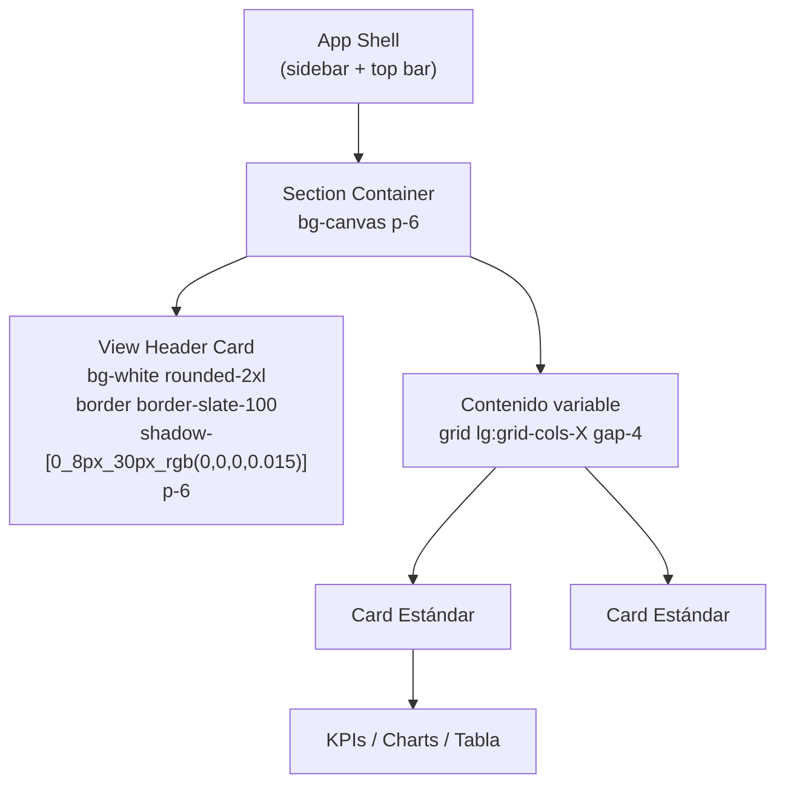

# GUÍA UI/UX — SISTEMA GESTIA (Design System)

> **Única fuente de verdad de diseño.** Define el sistema de diseño vigente de
> Gestia, con el **Dashboard como módulo de referencia**. Cualquier vista o
> componente nuevo, y cualquier refactor de un módulo existente, DEBE respetar
> esta guía y actualizarla en la misma PR si se introducen nuevos patrones.
>
> Fuente de verdad del código: `src/index.css` (design tokens),
> `src/components/dashboard/*` (patrón de referencia), `src/modulesConfig.tsx`.

---

## 1. Stack UI

| Capa | Tecnología |
|---|---|
| Framework UI | **React 19** |
| Bundler / dev | **Vite 6** |
| Estilos | **Tailwind CSS 4** vía plugin `@tailwindcss/vite` (sin PostCSS config) |
| Iconos | **`lucide-react`** (única librería) |
| Gráficos | **`recharts`** (`<ResponsiveContainer>` wrapping obligatorio) |
| Animación | **`motion`** (motion.dev) + helper de Tailwind `animate-fade-in` |
| Routing | Sin librería — conmutación por `useState(currentRole)` en `App.tsx` (NO introducir React Router sin ADR) |
| Formularios | Controlados con `useState` — sin librería (sin `react-hook-form`) |
| Notificaciones | **No hay librería externa** — esta guía define el patrón canónico (Sección 5) |

---

## 2. Design Tokens — `src/index.css`

Declarados vía Tailwind v4 `@theme`:

```css
@theme {
  --font-sans: "Inter", ui-sans-serif, system-ui, sans-serif;
  --font-display: "Sora", sans-serif;
  --font-mono: "IBM Plex Mono", ui-monospace, monospace;

  --color-canvas: #F2F6F4;       /* Fondo app */
  --color-surface: #FFFFFF;      /* Cards / modales */
  --color-ink: #16241F;          /* Texto principal */
  --color-ink-soft: #5B6B63;     /* Texto secundario */
  --color-ink-mute: #8CA097;     /* Texto terciario / labels */
  --color-hairline: #E1E9E4;     /* Bordes sutiles */

  --color-teal-brand: #0F9E82;   /* Color Mafort principal */
  --color-teal-deep: #0B3B34;    /* Variante oscura */
  --color-teal-mist: #E4F4EF;    /* Variante halo */

  --color-ai-brand: #6C6FE0;     /* Copiloto IA lila */
  --color-ai-mist: #EEEEFB;      /* IA halo */
}
```

### Reglas de uso de tokens
- **NUNCA** usar hex crudos (`bg-[#00B594]`) salvo que un componente legacy
  ya lo haga — el token canónico es `bg-[--color-teal-brand]` o, en
  shorthand Tailwind 4, `bg-teal-brand` (donde el token se haya expuesto).
- Componentes legacy que usan `bg-[#00B594]` representan el **mismo hex**
  del token `--color-teal-brand` (casi idéntico: `#0F9E82` vs `#00B594`).
  La homologación busca reemplazarlos una vez por componente, sin cambiar
  la percepción visual.
- **Tamaños tipográficos:** usar escala Tailwind (`text-xs`, `text-sm`,
  `text-base`, `text-lg`, `text-xl`, `text-2xl`). Las tailles arbitrarias
  tipo `text-[9px]`, `text-[10.5px]`, `text-[13px]` son **prohibidas en
  nuevo código** — solo se mantienen temporalmente en módulos no
  homologados.
- **Espaciados:** usar escala Tailwind (`gap-2`, `gap-3`, `p-4`, `p-6`).
  Los valores arbitrarios `w-8.5`, `h-8.5`, `gap-4.5`, `mb-4.5`, `pb-4.5`
  son **inválidos en Tailwind v4** y se ignoran silenciosamente — prohibido
  usarlos.

### Tipografías
- **Display** (`Sora`): títulos de vista, encabezados de card grande, KPIs
  hero. Aplicar con `font-display`.
- **Body** (`Inter`): todo el cuerpo de texto, labels, botones, tablas,
  inputs. Es el default global.
- **Mono** (`IBM Plex Mono`): IDs, números técnicos, KPIs valorizados,
  badges monoespaciadas, timestamps. Aplicar con `font-mono`.

### Paleta semántica para status
| Estado | Color | Token | Fondo uso |
|---|---|---|---|
| Éxito | Emerald | Tailwind `emerald-*` (50/100/500/700) | Confirmaciones |
| Advertencia | Amber | Tailwind `amber-*` | Pendientes, alertas medias |
| Peligro / Error | Rose | Tailwind `rose-*` (50/100/500/600) | Errores, rechazos |
| Info | Sky / Blue | Tailwind `sky-*` o `blue-*` | Informativo |
| Neutro | Slate | Tailwind `slate-*` (50/100/400/500/800/900) | Default |
| IA | Lila | `--color-ai-brand` / `ai-mist` | Copiloto IA |

---

## 3. Estructura Visual de una Vista (Patrón Dashboard)

Toda vista estándar sigue esta jerarquía:



### 3.1 Container / Section
```tsx
<div className="min-h-screen bg-canvas p-4 sm:p-6 max-w-[1500px] mx-auto">
  {/* Header */}
  {/* Contenido grid */}
</div>
```

### 3.2 Header Card — patrón `DashboardHeader`
- Recipient: `bg-white rounded-2xl border border-slate-100 p-6 shadow-[0_8px_30px_rgb(0,0,0,0.015)]`
- Layout: `flex flex-col lg:flex-row justify-between gap-4`
- Título: `text-2xl font-black tracking-tight text-slate-900`
- Subtítulo: `text-xs text-slate-400 font-bold font-mono uppercase tracking-wider`
- Chips / Badges: ver Sección 4.

### 3.3 Card estándar — patrón `KpiCardsGrid`
```tsx
<div className="bg-white rounded-2xl border border-slate-100 shadow-sm p-5 space-y-3">
  {/* header de card */}
  <div className="flex items-center gap-3">
    <div className="w-10 h-10 rounded-xl bg-emerald-50 text-emerald-600 flex items-center justify-center">
      <Activity size={18} />
    </div>
    <div>
      <h4 className="font-bold text-slate-900 text-sm">{title}</h4>
      <p className="text-[10px] text-slate-400 font-mono uppercase tracking-wider">{subtext}</p>
    </div>
  </div>
  {/* value sparkline / chart / link */}
</div>
```

### 3.4 Sidebar — definido en `src/modulesConfig.tsx`
Estructura `APP_MODULES`: items por rol con `lucide-react` icons. No
modificar estilos ad-hoc en `App.tsx` — toda personalización de nav
se hace en `modulesConfig.tsx`.

---

## 4. Componentes Shared & Patrones

### 4.1 Botones
| Tipo | Clases (usar siempre juntas) |
|---|---|
| **Primary** (acción principal) | `bg-[--color-teal-brand] hover:bg-teal-deep text-white font-bold text-xs px-4 py-2.5 rounded-xl shadow-sm hover:shadow-md transition-all active:scale-95 cursor-pointer` |
| **Secondary** | `bg-slate-100 hover:bg-slate-200 text-slate-700 font-bold text-xs px-4 py-2.5 rounded-xl transition-all cursor-pointer` |
| **Danger** | `bg-rose-500 hover:bg-rose-600 text-white font-bold text-xs px-4 py-2.5 rounded-xl shadow-sm transition-all cursor-pointer` |
| **Ghost / icon button** | `w-9 h-9 rounded-xl bg-slate-50 border border-slate-150 hover:bg-slate-100 text-slate-600 hover:text-slate-900 transition-colors cursor-pointer` |

> [!NOTE]
> El hex legacy `bg-[#00B594]` se usa aún en `ClientesContratosView.tsx`,
> `DashboardHeader.tsx` y otros. Es **casi idéntico** al token
> `--color-teal-brand: #0F9E82`. La homologación reemplaza progresivamente
> `bg-[#00B594]` → `bg-teal-brand` (diferencia imperceptible visualmente).

### 4.2 Inputs / Forms
```tsx
<input
  type="text"
  value={value}
  onChange={e => setValue(e.target.value)}
  className="w-full px-3 py-2 text-sm border border-slate-200 rounded-lg bg-white
             focus:outline-none focus:ring-2 focus:ring-teal-brand/40
             focus:border-teal-brand transition-all"
  placeholder="..."
/>
```

### 4.3 Tables
```tsx
<table className="w-full text-sm">
  <thead className="bg-slate-50 text-slate-500 font-mono uppercase tracking-wider text-[10px]">
    <tr>
      <th className="text-left p-3">Columna</th>
    </tr>
  </thead>
  <tbody>
    <tr className="border-b border-slate-100 hover:bg-slate-50 transition-colors">
      <td className="p-3 text-slate-700">{value}</td>
    </tr>
  </tbody>
</table>
```
- Headers siempre en `font-mono uppercase tracking-wider text-[10px]`
  (no usar `text-[9px]`).
- Filas con `hover:bg-slate-50` para feedback.
- Bordes solo `border-b border-slate-100` (sin grid completo).

### 4.4 Modales y Drawers (patrón portal)

#### Modal centrado (default)
```tsx
{createPortal(
  isOpen ? (
    <div
      className="fixed inset-0 z-[9999] flex items-center justify-center
                 bg-slate-900/60 backdrop-blur-xs p-4 animate-fade-in"
      onClick={onClose}  // clic fuera cierra
    >
      <div
        className="bg-white rounded-3xl shadow-2xl w-full max-w-md max-h-[90vh]
                   overflow-y-auto border border-slate-200"
        onClick={e => e.stopPropagation()}
      >
        {/* Header del modal */}
        <div className="px-6 py-4 border-b border-slate-100 flex items-center justify-between">
          <h3 className="font-bold text-slate-900 text-base font-display">
            {title}
          </h3>
          <button onClick={onClose} className="ghost-icon-btn">
            <X size={18} />
          </button>
        </div>
        {/* Body */}
        <div className="p-6 space-y-4 text-sm text-slate-700">{children}</div>
        {/* Footer opcional */}
        <div className="px-6 py-4 border-t border-slate-100 flex justify-end gap-2">
          <button className="btn-secondary">Cancelar</button>
          <button className="btn-primary">Guardar</button>
        </div>
      </div>
    </div>
  ) : null,
  document.body
)}
```

#### Drawer lateral derecho (para detalles / formularios largos)
```tsx
{createPortal(
  isOpen ? (
    <div className="fixed inset-0 z-[9999] bg-slate-900/60 backdrop-blur-xs animate-fade-in"
         onClick={onClose}>
      <div
        className="absolute right-0 top-0 h-full w-full max-w-md bg-white shadow-2xl
                   overflow-y-auto animate-slide-in-right"
        onClick={e => e.stopPropagation()}
      >
        {/* Igual estructura header/body/footer */}
      </div>
    </div>
  ) : null,
  document.body
)}
```

### 4.5 Badges / Chips
```tsx
// Status badge
<span className="inline-flex items-center gap-1.5 px-3 py-1.5 bg-emerald-50
                 border border-emerald-200/80 rounded-xl text-xs font-bold
                 font-mono text-emerald-700">
  <span className="w-2 h-2 rounded-full bg-emerald-500 animate-pulse" />
  Conexión estable
</span>

// KPIs small badge
<span className="inline-flex items-center px-2 py-0.5 bg-amber-50 border
                 border-amber-200/60 rounded-full text-[10px] font-bold
                 font-mono uppercase tracking-wider text-amber-700">
  Urgente
</span>
```
- Colores: `emerald` / `amber` / `rose` / `sky` — nunca colores custom fuera
  de la escala Tailwind.

---

## 5. Notificaciones y Mensajes (Patrón Canónico)

> [!IMPORTANT]
> Esta es la sección **más crítica** de la homologación actual. Gestia tiene
> tres sistemas de notificación coexistentes. **A partir de ahora hay un único
> patrón canónico**: el `alertState` modal definido en
> `ClientesContratosView.tsx` (líneas 84-95 + 2823-2866), porteado a un
> componente reutilizable.

### 5.1 Patrón canónico — `<ToastModal>` (a crear como shared component)

Estado:
```ts
type AlertType = 'success' | 'error' | 'offline' | 'info';
interface ToastState {
  show: boolean;
  type: AlertType;
  title: string;
  message: string;
}
const [alertState, setAlertState] = useState<ToastState>({
  show: false,
  type: 'success',
  title: '',
  message: ''
});

function notify(type: AlertType, title: string, message: string) {
  setAlertState({ show: true, type, title, message });
}
```

Estructura visual (copiada verbatim de `ClientesContratosView`):
```tsx
{createPortal(
  alertState.show ? (
    <div
      className="fixed inset-0 z-[9999] flex items-center justify-center
                 bg-slate-900/60 backdrop-blur-xs p-4 animate-fade-in
                 text-slate-800 font-sans"
      id="gestia-notification-modal"
      onClick={() => setAlertState(prev => ({ ...prev, show: false }))}
    >
      <div
        className="bg-white border border-slate-200 w-full max-w-sm rounded-3xl
                   p-5 shadow-2xl space-y-4 text-left"
        onClick={e => e.stopPropagation()}
      >
        {/* Header con icono circular + título + label */}
        <div className="flex items-center gap-3 pb-2 border-b border-slate-100">
          <div className={`w-10 h-10 rounded-full flex items-center
                          justify-center shrink-0 ${
            alertState.type === 'success' ? 'bg-emerald-50 border border-emerald-100 text-emerald-500' :
            alertState.type === 'error'   ? 'bg-rose-50 border border-rose-100 text-rose-500' :
            alertState.type === 'offline' ? 'bg-sky-50 border border-sky-100 text-sky-500' :
                                             'bg-sky-50 border border-sky-100 text-sky-500'
          }`}>
            {alertState.type === 'success' ? <CheckCircle2 size={18} /> :
             alertState.type === 'error'   ? <XCircle size={18} /> :
             <Cloud size={18} />}
          </div>
          <div>
            <h4 className="font-bold text-slate-850 text-sm">{alertState.title}</h4>
            <p className="text-[10px] text-slate-400 uppercase font-mono tracking-wide">
              GESTIA HUB & CONTROL DE CALIDAD
            </p>
          </div>
        </div>

        <p className="text-xs text-slate-600 leading-relaxed font-sans">
          {alertState.message}
        </p>

        <div className="flex items-center justify-end pt-2">
          <button
            type="button"
            onClick={() => setAlertState(prev => ({ ...prev, show: false }))}
            className={`px-5 py-2 rounded-xl text-xs font-bold cursor-pointer
                        transition-all ${
              alertState.type === 'success' ? 'bg-[#00B594] hover:bg-[#009b7e] text-white shadow-sm' :
              alertState.type === 'error'   ? 'bg-rose-500 hover:bg-rose-600 text-white shadow-sm' :
                                               'bg-slate-800 hover:bg-slate-900 text-white shadow-sm'
            }`}
          >
            Entendido
          </button>
        </div>
      </div>
    </div>
  ) : null,
  document.body
)}
```

### 5.2 Convenciones de uso

**Toda acción que el usuario confirme (guardado, asignación, eliminación,
envío, etc.) DEBE usar este patrón.** Mensaje tipo:

| Acción | type | title | message |
|---|---|---|---|
| Guardar registro | `success` | "Registro Exitoso" | "El {recurso} se ha guardado correctamente." |
| Actualizar registro | `success` | "Actualización Exitosa" | "El {recurso} se ha actualizado correctamente." |
| Asignar técnico / equipo | `success` | "Asignación Exitosa" | "El {recurso} se ha asignado correctamente." |
| Guardar offline | `offline` | "Guardado Offline" | "Se guardará localmente y se sincronizará automáticamente al recuperar la conexión." |
| Error de validación | `error` | "No se pudo completar" | "{descripción del error}" |
| Error de red | `error` | "Error de Conexión" | "Verifique su conexión e intente nuevamente." |

### 5.3 Prohibido

- ❌ `window.alert(...)` nativo — son modales del browser, no respetan el
  design system. Hay **44 usos** repartidos en 11 archivos (ver
  [inventario_inconsistencias_ui.md](./inventario_inconsistencias_ui.md)
  para la lista completa y el plan de migración).
- ❌ Banners de notificación inline en el layout (estilo `DashboardHeader`
  tiene un bell con badge hardcoded "3").
- ❌ `console.log` como feedback de usuario.

### 5.4 Toasts auto-dismiss (futuro)
El patrón canónico actual es **modal** (requiere clic en "Entendido"). Si en
el futuro se desea un toast transitorio (auto-dismiss 3s) para mensajes
puros de éxito, agregar el tipo `'toast'` al `ToastState` y un `setTimeout`
en el `notify()`. **No introducir** otra librería (`sonner`, `react-hot-toast`).

### 5.5 Patrón canónico — `<ConfirmModal>` (confirmaciones binarias)

> [!IMPORTANT]
> Para acciones **destructivas o irreversibles** (eliminar, anular,
> finalizar, resetear) el `window.confirm()` nativo está prohibido. El
> patrón canónico es `<ConfirmModal>` + hook `useConfirm`, complementary al
> `<ToastModal>` (que es solo informativo con 1 botón).

Componente shared: `src/components/shared/ConfirmModal.tsx`.
Hook: `useConfirm()` — devuelve `{ confirm, closeConfirm, confirmView }`.
API:
```ts
type ConfirmTone = 'danger' | 'warning' | 'info';
interface ConfirmOptions {
  title: string;
  message: string;
  confirmLabel?: string;   // default: 'Confirmar'
  cancelLabel?: string;    // default: 'Cancelar'
  tone?: ConfirmTone;      // default: 'warning'
}
const { confirm, confirmView } = useConfirm();
const ok = await confirm({
  title: 'Anular Línea de OT',
  message: '¿Está seguro de anular lógicamente la línea de OT #OT-001? Se marcará como ANULADO.',
  confirmLabel: 'Anular',
  tone: 'danger'
});
if (ok) { /* ejecutar acción irreversible */ }
```

Reuso del shell visual del `<ToastModal>` (mismo `bg-slate-900/60 backdrop-blur-xs`, misma card `bg-white border-slate-200 max-w-sm rounded-3xl p-5 shadow-2xl`, mismo header `flex items-center gap-3 pb-2 border-b border-slate-100`). Diferencias:
- **2 botones** (Cancelar + Confirmar) en `justify-end gap-2`, no uno solo.
- **Confirm `autoFocus`** + atajos teclado: `Enter` = confirmar, `Esc` = cancelar.
- **Icono `AlertTriangle`** (en vez de `CheckCircle2`/`XCircle`/`Cloud`/`Info`).
- **Etiquetas intensidad (`tone`)**:
  - `danger` (eliminar/anular/bajas definitivas): icono rosa, botón `bg-rose-500`.
  - `warning` (finalizar/reset por defecto): icono amber, botón `bg-teal-brand`.
  - `info` (confirmaciones no destructivas): icono sky, botón `bg-slate-800`.
- **`<dialog open>`** nativo para foco gestionado por el browser + `aria-modal`, `aria-labelledby`, `aria-describedby` (WCAG AA).
- `confirmView` se renderiza una sola vez, al final del `return` del componente, junto a `toastView`.

Convenciones de uso:

| Escenario | tone | title | confirmLabel sugerido |
|---|---|---|---|
| Anular OT | `danger` | "Anular Línea de OT" | "Anular" |
| Eliminar usuario | `danger` | "Eliminar Usuario" | "Eliminar" |
| Finalizar servicio | `warning` | "Finalizar Servicio" | "Finalizar" |
| Reset formulario (perder borrador) | `warning` | "Restablecer Formulario" | "Restablecer" |
| Cambio de estado reversible | `info` | "Confirmar Cambio" | "Aplicar" |

---

## 6. Iconografía

- Única librería permitida: **`lucide-react`**.
- Tamaños estándar: `12`, `14`, `16`, `18`, `20`, `24`. Evitar `13`, `11`,
  `15` — ya presentes en módulos no homologados, ir reemplazando.
- Uso dentro de botones: `<Icon size={14} />` junto a `<span>Texto</span>`
  con `gap-2`.
- Sin emojis en UI (emoji está presente en algunos `alert()` nativos —
  homologación los elimina).

---

## 7. Animaciones

- `animate-fade-in` (helper global en `src/index.css`) → fade in 250ms para
  modales y vistas.
- `animate-pulse-line` para dashboards animados.
- `active:scale-95` para feedback táctil en botones.
- **No introducir** más keyframes sin añadirlos a `src/index.css` primero.

---

## 8. Responsividad

- Mobile-first con Tailwind breakpoints `sm`, `md`, `lg`, `xl`.
- Layouts default `flex flex-col` → `lg:flex-row` (ver `DashboardHeader`).
- Max-width contenedor: `max-w-[1500px] mx-auto`.
- En móvil, modales se vuelven full-width (`w-full max-w-sm`).

---

## 9. Accesibilidad

- Todos los botones `cursor-pointer` + `title="..."` con descripción.
- Inputs con `<label>` y `htmlFor` asociado (no solo placeholder).
- `focus:outline-none focus:ring-2 focus:ring-teal-brand/40` en inputs.
- Contraste: texto principal `text-slate-900` sobre `bg-white` (AAA), texto
  secundario `text-slate-500` (AA).
- Modales: cerrar con ESC o clic fuera (ambos implementados).

---

## 10. Regla de Oro

> **El Dashboard es el patrón de referencia.** Toda vista nueva o refactor
> debe verse y comportarse como el Dashboard:
>
> 1. Mismas tarjetas `bg-white rounded-2xl border border-slate-100 shadow-sm`.
> 2. Mismo `DashboardHeader`-style con título `text-2xl font-black` y badges
>    `font-mono uppercase text-xs`.
> 3. Mismo sistema de notificaciones (`<ToastModal>` patrón Sección 5).
> 4. Mismos botones teal/slate con `active:scale-95`.
> 5. Mismas tablas con header `font-mono uppercase tracking-wider`.
> 6. Ningún `window.alert`, ningún color crudo fuera de los tokens.

---

## 11. Roadmap de Homologación

Ver [inventario_inconsistencias_ui.md](./inventario_inconsistencias_ui.md) para
el detalle de hallazgos por módulo y plan de migración.

Prioridades:
1. **Critico**: eliminar 44 `window.alert(...)` → `<ToastModal>` patrón.
2. **Alto**: crear componente shared `<Modal>` y `<Drawer>` para reemplazar
   los createPortal duplicados.
3. **Medio**: reemplazar hex crudos `bg-[#00B594]` por `bg-teal-brand`.
4. **Medio**: eliminar utilities Tailwind inválidas (`w-8.5`, `gap-4.5`).
5. **Bajo**: consolidar tablas en un `<DataTable>` reutilizable.

---

## 12. Referencias

- `src/index.css` — design tokens.
- `src/components/dashboard/*` — patrón de referencia.
- `src/modulesConfig.tsx` — navegación por rol.
- [Inventario de Inconsistencias UI](./inventario_inconsistencias_ui.md) —
  hallazgos por archivo y plan de migración.
- [Architecture C4](./architecture_c4.md) — vista general del sistema.
