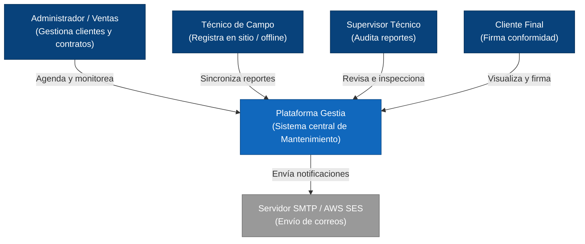
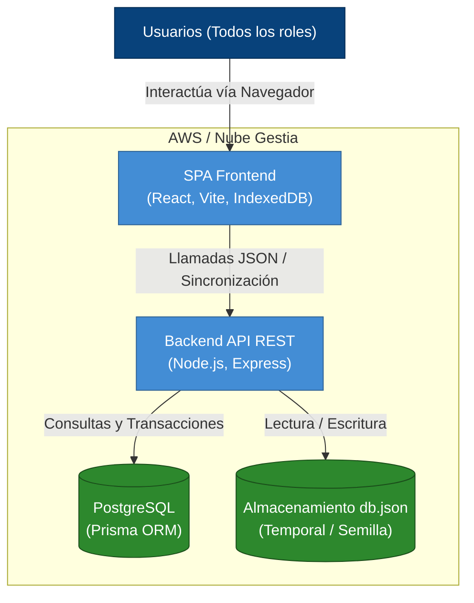
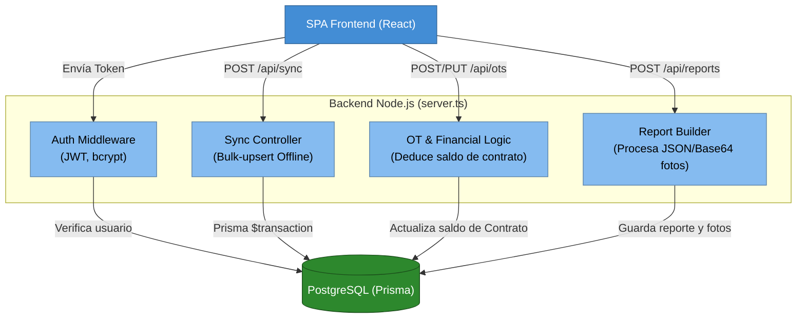
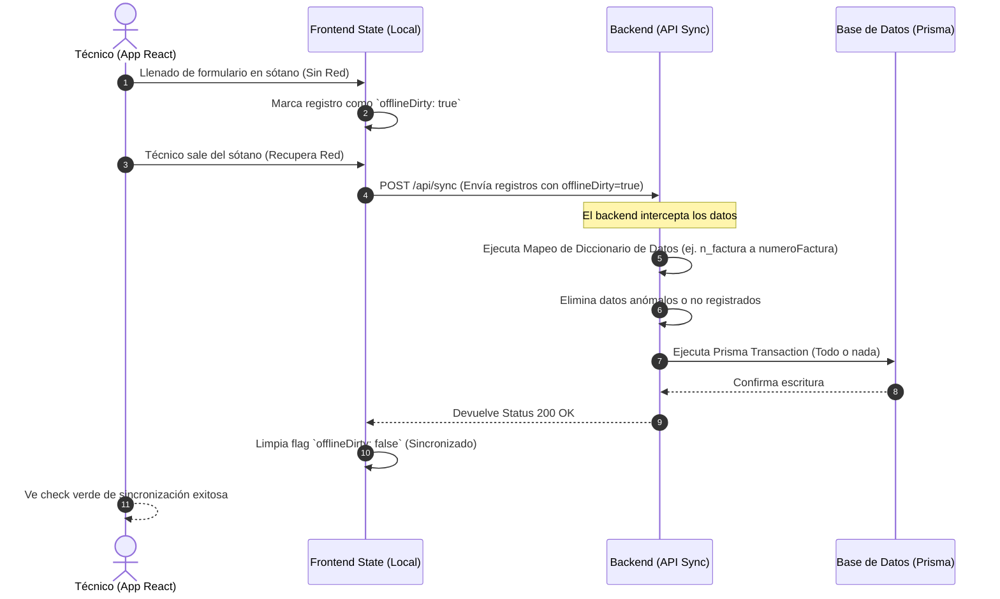

# ARQUITECTURA DEL SISTEMA — PROYECTO GESTIA (Modelo C4)

Este documento describe la arquitectura real y actual del proyecto Gestia, basándose en la implementación existente (React + Node.js + PostgreSQL), superando la especificación original que planteaba tecnologías diferentes.

Se utiliza el **Modelo C4** (Contexto, Contenedores, Componentes) para ofrecer vistas desde lo más general hasta lo más detallado.

---

## 1. Nivel 1: Diagrama de Contexto (Context Diagram)
*Muestra el panorama general: quiénes usan el sistema y con qué interactúan.*

---

## 2. Nivel 2: Diagrama de Contenedores (Container Diagram)
*Muestra la arquitectura de alto nivel y las opciones tecnológicas (Frontend vs Backend).*

---

## 3. Nivel 3: Diagrama de Componentes (Backend API)
*Zoom al interior del contenedor Node.js (server.ts) para entender cómo procesa la lógica pesada.*

---

## 4. Flujo de Sincronización Offline Crítico (Secuencia)
Dado que los técnicos pueden entrar a sótanos sin internet, la aplicación depende de este flujo.

