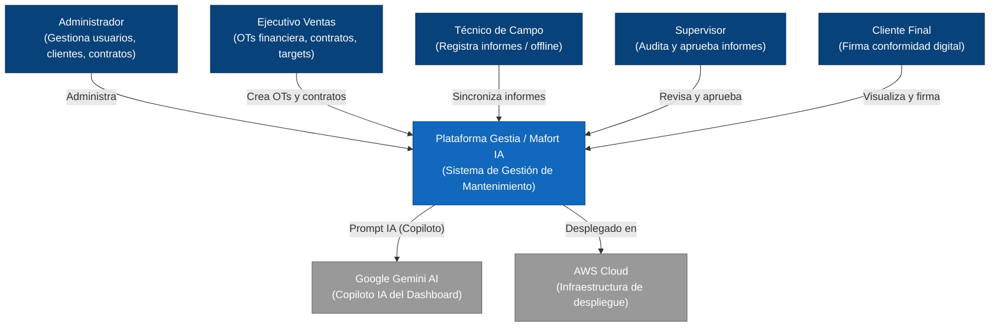
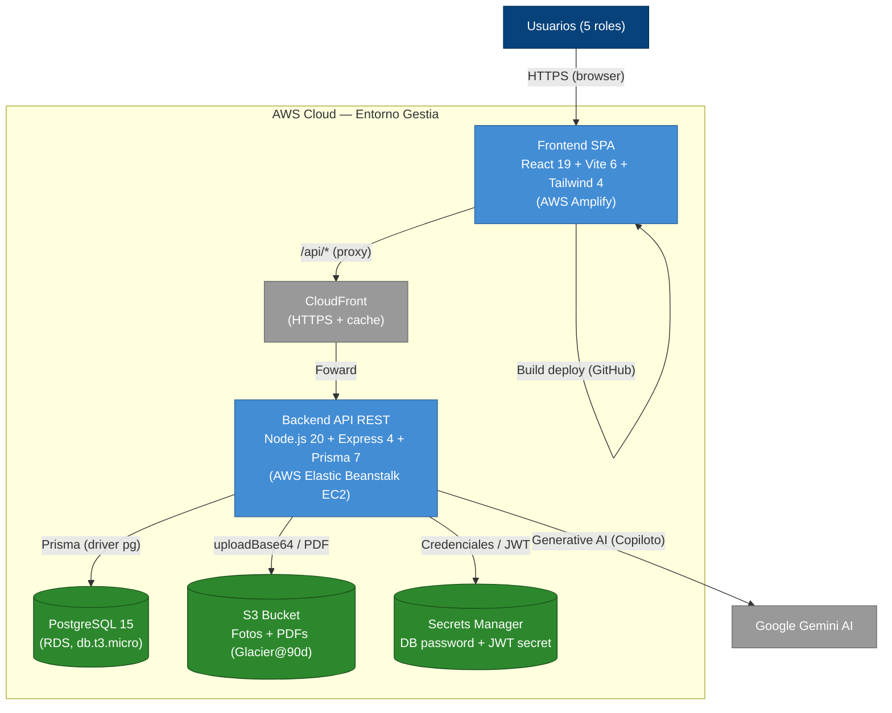
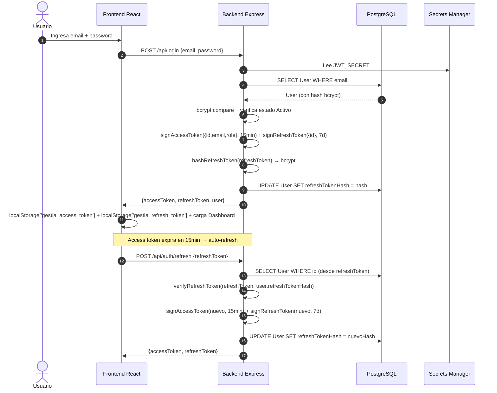
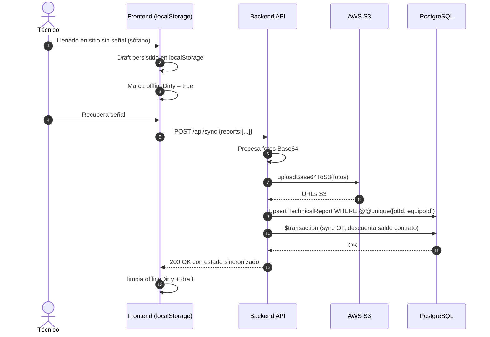
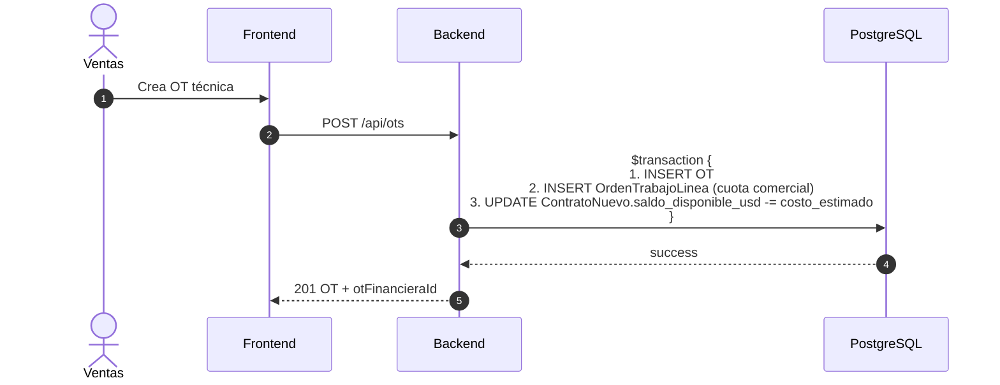

# ARQUITECTURA DEL SISTEMA — PROYECTO GESTIA (Modelo C4)

> **Única fuente de verdad arquitectónica.** Este documento describe la
> arquitectura **real y vigente** del sistema Gestia, alineada con la
> implementación actual (React 19 + Express 4 + PostgreSQL 15 + AWS).
> Cualquier cambio en infraestructura o componentes DEBE actualizarse aquí en
> la misma PR que introduce el cambio.
>
> **Versión:** 2.0 — Reescritura completa basada en auditoría del código y
> Terraform (2026-07-24). Reemplaza la versión anterior que mencionaba
> `db.json`, IndexedDB y SMTP/SES que ya no forman parte del sistema.

---

## 1. Nivel 1: Diagrama de Contexto (Context Diagram)

Panorama general: quién usa el sistema y con qué interactúa.

**Actores (5 roles):**
| Actor | Permisos |
|---|---|
| Administrador | Usuarios, clientes, contratos, todas las OT, reportes, configuración |
| Ventas | Clientes, contratos comerciales, OT financiera, targets |
| Supervisor | Auditoría y aprobación de informes técnicos |
| Técnico | Portal offline, captura de informes con fotos/firma |
| Cliente | Portal de visualización y firma digital |

**Sistemas externos:**
- **Google Gemini AI** (`@google/genai`) — Copiloto IA en el Dashboard (key `GEMINI_API_KEY`).
- **AWS Cloud** — Toda la infraestructura productiva (ver [arquitectura_infraestructura_nube.md](./arquitectura_infraestructura_nube.md)).

---

## 2. Nivel 2: Diagrama de Contenedores (Container Diagram)

**Contenedores:**

| Contenedor | Tecnología | Localización | Descripción |
|---|---|---|---|
| Frontend SPA | React 19 + Vite 6 + Tailwind 4 | AWS Amplify (repo GitHub) | Interfaz de usuario. Sin router, conmutación por rol vía `useState` |
| CDN | CloudFront | AWS edge | HTTPS + redirect-to-https, cacheo estático |
| Backend API | Express 4 + Prisma 7 + bcrypt + JWT | Elastic Beanstalk (EC2 t3.micro, Node 20 AL2023) | Único `server.ts` (~3000 líneas) con ~85 endpoints REST |
| Base de datos | PostgreSQL 15 + Prisma ORM | RDS db.t3.micro, gp2 20GB | Schema con 19 modelos (ver [data_dictionary.md](./data_dictionary.md)) |
| Blob storage | S3 (fotos + PDFs) | bucket `gestia-dev-photos` | Ciclo de vida Glacier@90d, versionado, SSE-AES256 |
| Secrets | AWS Secrets Manager | `/gestia/{env}/db_password`, `/jwt_secret` | Credenciales RDS y JWT |

**Sin estado externo**: el legacy `db.json` y `IndexedDB` se eliminaron en la migración a S3. La persistencia offline se maneja en `localStorage` del técnico (drafts), sincronizados vía `/api/sync`.

---

## 3. Nivel 3: Diagrama de Componentes (Backend API)

Zoom al interior del único contenedor backend (`server.ts`).

```mermaid
flowchart TD
    classDef component fill:#85bbf0,stroke:#5b82b8,color:#000
    classDef external fill:#438dd5,stroke:#2e6295,color:#fff
    classDef db fill:#2d882d,stroke:#1a4d1a,color:#fff
    classDef store fill:#f5a623,stroke:#c47e0e,color:#fff

    SPA["SPA Frontend (React)"]:::external
    DB[("PostgreSQL (Prisma)")]:::db
    S3[("S3")]:::store
    SM[("Secrets Manager")]:::db

    subgraph ServerTS ["Backend Node.js — server.ts (2139 líneas)"]
        direction TB
        Auth["Auth Middleware\n(JWT, bcrypt, 24h)"]:::component
        Users["UserController\n(/api/users, /api/login, /api/logs)"]:::component
        Ubigeo["UbigeoController\n(/api/ubigeo/*)"]:::component
        Clients["ClientsController\n(/api/clients)"]:::component
        Legacy["LegacyContracts\n(/api/contracts)"]:::component
        Contratos["ContratosController\n(/api/contratos-comerciales, ampliaciones)"]:::component
        Equipos["EquiposController\n(/api/equipos, /api/contracts/*/equipos)"]:::component
        OTs["OTController\n(/api/ots + auto-crea OTLinea + descuenta saldo)"]:::component
        Reports["ReportsController\n(/api/reports, fotos→S3, @@unique)"]:::component
        Sync["SyncController\n(/api/sync bulk-upsert offline)"]:::component
        OTLinea["OTLineaController\n(/api/ot-lineas factura, lock FACTURADO)"]:::component
        Asign["OtEquipoAsignController\n(/api/ot-equipo-asignaciones)"]:::component
        S3Helper["S3Helper\n(uploadBase64, deleteS3, PDF/auth)"]:::component
        AI["GeminiAdapter\n(Copiloto IA Dashboard)"]:::component
        Seed["BootSeeders\n(TipoContrato, ubigeo, fixes client)"]:::component
    end

    SPA -- "Bearer Token" --> Auth
    Auth -- "verify JWT" --> SM
    SPA -- "/api/*" --> Users
    SPA -- "/api/*" --> Clients
    SPA -- "/api/*" --> Contratos
    SPA -- "/api/*" --> Equipos
    SPA -- "/api/*" --> OTs
    SPA -- "/api/*" --> Reports
    SPA -- "/api/sync" --> Sync
    SPA -- "/api/*" --> OTLinea

    Auth --> Users
    Users --> DB
    Ubigeo --> DB
    Clients --> DB
    Contratos --> DB
    Equipos --> DB
    OTs --> DB
    Reports --> DB
    Reports --> S3Helper
    Sync --> DB
    OTLinea --> DB
    Asign --> DB
    S3Helper --> S3
    AI -- "prompt Gemini" --> SPA
    Seed --> DB
```

**Componentes del backend (single-file `server.ts`):**

| Componente | Líneas aprox. | Responsabilidad |
|---|---|---|
| `Auth Middleware` | 110–125 | Verifica JWT, fallback `?token=`, suspende `Suspendido` |
| `UserController` | 127–305 | Login, CRUD users, activity log |
| `UbigeoController` | 361–394 | Catálogo geográfico Perú (`Pais`/`Provincia`/`Distrito`) |
| `ClientsController` | 395–458 | CRUD clientes |
| `Legacy Contracts` | 460–477 | Contratos anuales heredados (`Contract`) |
| `ContratosController` | 1813–1954 | ContratoNuevo + ContratoAmpliacion, PDFs a S3 |
| `EquiposController` | 1506–1664 | Catalogación de equipos, servicios, estado |
| `AsignController` | 1412–1505 | Pivote OT ↔ equipo con técnicos |
| `OTController` | 479–772 | Crea OT técnica + OT financiera atómica, descuenta saldo contrato |
| `ReportsController` | 773–950 | Upsert por `@@unique([otId, equipoId])`, conversión Base64→S3 |
| `SyncController` | 951–1106 | `/api/sync` — bulk upsert offline (reports, OTs, clientes, contratos nuevos) |
| `OTLineaController` | 1107–1237 | Línea financiera, auto-factura, lock FACTURADO |
| `S3Helper` | 22–79, 1239–1410 | `uploadBase64ToS3`, `uploadContractBase64ToS3`, `uploadEquipoPhotoToS3`, `deleteFromS3`, role-gated file serving |
| `GeminiAdapter` | embebido en CopilotoIAPanel | Generación de insights, KPI narratives |
| `BootSeeders` | arranque servidor | `seedTipoContratos`, `runDataFixes`, `ensureUbigeoData` |

---

## 4. Flujos Críticos (Secuencia)

### 4.1 Login + Auth (Access + Refresh Tokens)

### 4.2 Captura de Informe Técnico Offline

### 4.3 Creación de OT + OT Financiera Atómica

---

## 5. Decisiones Arquitectónicas Clave

1. **Single-server monolith**: un único `server.ts` con todos los endpoints (~85) y helpers. No hay capa de servicios, ni controllers folder. Trade-off: simplicidad inicial + deuda de mantenimiento.
2. **Sin router en el frontend**: `App.tsx` conmuta vistas por `useState(currentRole)`. Las rutas se definen en `src\modulesConfig.tsx`. Permite SSR-free deploy en Amplify estático.
3. **Prisma `migrate deploy` en producción**: el deploy CI ejecuta `prisma migrate deploy` (Procfile). Migraciones versionadas en `prisma/migrations/`. **Resuelto (2026-08-29)**.
4. **`localStorage` para offline**: los técnicos persisten drafts en `gestia_offline_queue`. No hay IndexedDB. Sync vía `/api/sync` endpoint bulk.
5. **S3 como blob storage**: fotos de informes (`reports/`), PDFs de contratos (`contracts/`), fotos de equipos (`equipo/`). URLs guardadas en columnas del schema; nunca Base64 en DB.
6. **JWT Access + Refresh Tokens**: Access 15min + Refresh 7d con revocación en BD (`User.refreshTokenHash`). Endpoints `/api/auth/refresh`, `/api/auth/logout`. **Resuelto (2026-08-29)**.
7. **Rate Limiting + CORS**: 100 req/min `/api/*`, 200 req/min `/api/sync`. CORS con `ALLOWED_ORIGINS` env. **Resuelto (2026-08-29)**.
8. **No hay jobs programados**: no cron, no queues. Las tareas (`seedTipoContratos`, `runDataFixes`, `ensureUbigeoData`) se ejecutan al arranque del servidor.
9. **PWA Scope**: Solo rol Técnico (`VITE_PWA_TECNICO=1` en dev/qa, 0 en prod). Service Worker `src/sw.ts` + `vite-plugin-pwa`.

---

## 6. Deuda Técnica Arquitectónica

| Item | Impacto | Riesgo | Estado |
|---|---|---|---|
| `server.ts` monolítico (~3000 líneas) | Mantenibilidad | Alto al escalar | 🟡 Vigente |
| `prisma db push --accept-data-loss` en prod | Pérdida de datos silenciosa | Crítico | ✅ **Resuelto** (migrate deploy) |
| JWT sin refresh ni revocación | UX de sesión | Medio | ✅ **Resuelto** (access/refresh + revocación) |
| `authenticateToken` silenciosamente pasa si no hay token | Seguridad | Medio | ✅ **Resuelto** (401 en endpoints protegidos) |
| No hay rate limiting | Abuso de API | Bajo (uso interno) | ✅ **Resuelto** (100/200 req/min) |
| Boot seeders en cold start | Lentitud en deploy | Bajo | 🟡 Vigente |
| Relaciones soft FK (sin `@relation`) en la mayoría de modelos | Integridad referencial | Medio | 🟡 Vigente |
| Typo `adensasOrigen` propagado | Limpieza cosmética | Bajo | 🟡 Vigente |
| Inconsistencia UI/UX entre módulos | UX | Alto | 🟡 Vigente (ver [inventario_inconsistencias_ui.md](./inventario_inconsistencias_ui.md)) |
| **Nueva**: Monolito creciendo (~3000 líneas) | Mantenibilidad | Alto | 🟡 Vigente |
| **Nueva**: `GeminiAdapter` embebido (no componente separado) | Separación de responsabilidades | Medio | 🟡 Vigente |

---

## 7. Referencias

- [Diccionario de Datos Maestro](./data_dictionary.md) — modelo de datos (19 modelos Prisma).
- [Arquitectura e Infraestructura en la Nube](./arquitectura_infraestructura_nube.md) — Terraform, CI/CD, AWS modules.
- [Guía UI/UX](./guia_ui_ux.md) — design system, tokens, componentes compartidos.
- [Inventario de Inconsistencias UI](./inventario_inconsistencias_ui.md) — hallazgos por módulo y plan de homologación.
- `prisma/schema.prisma` — fuente de verdad del modelo de datos.
- `server.ts` — fuente de verdad del backend.
- `infra/` — fuente de verdad de la infraestructura.
