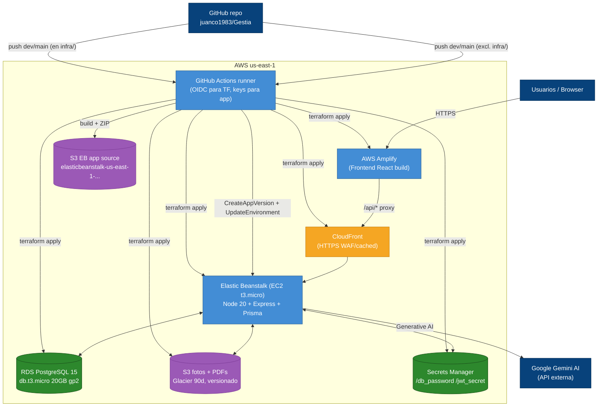
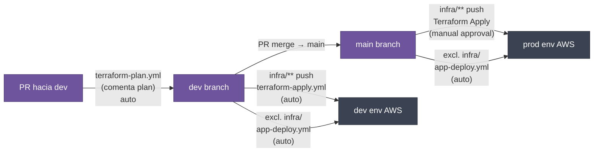

# ARQUITECTURA E INFRAESTRUCTURA EN LA NUBE — GESTIA (AWS)

> **Única fuente de verdad de infraestructura.** Describe cómo se despliega y
> opera Gestia en AWS. Cualquier cambio en Terraform, CI/CD o topología de
> nube DEBE actualizarse aquí en la misma PR que introduce el cambio.
>
> Fuente de verdad del código: `infra/`, `.github/workflows/`,
> `.ebextensions/`, `.platform/`, `Procfile`.

---

## 1. Topología General (AWS)



---

## 2. Cuentas AWS

| Recurso | Identificador |
|---|---|
| Cuenta AWS | `325580897755` (implícito en S3 bucket name) |
| Región | `us-east-1` |
| Proyecto | `gestia` (prefijo de todos los recursos) |
| Entornos | `dev`, `prod` (este último todavía sin desplegar a full) |
| Bucket S3 fuente EB | `elasticbeanstalk-us-east-1-325580897755` |
| Bucket S3 fotos/PDFs | `gestia-dev-photos` (env var `AWS_S3_BUCKET` override en prod) |
| Repo GitHub | `juanco1983/Gestia` |

---

## 3. Terraform IaC — `infra/`

Estructura modular del repositorio:

```
infra/
├── README.md
├── bootstrap.ps1              ← crea state bucket + DynamoDB lock (one-time)
├── environments/
│   ├── dev/
│   │   ├── main.tf           ← invoca módulos (project=gestia, env=dev)
│   │   ├── variables.tf      ← define db_password, jwt_secret, github_token (sensitive)
│   │   └── outputs.tf
│   └── prod/                  ← pendiente de revisar si existe
└── modules/
    ├── networking/            ← VPC 10.0.0.0/16, 2 AZ, public + private subnets, IGW
    ├── security/              ← SG backend (80/443/3001), SG RDS (5432 from backend only),
    │                            IAM roles (beanstalk_ec2, beanstalk_service),
    │                            Secrets Manager entries
    ├── database/              ← RDS Postgres 15, db.t3.micro, 20GB gp2, encrypted,
    │                            no Multi-AZ, no backups (DEV Free Tier)
    ├── backend/              ← Elastic Beanstalk app + SingleInstance env (Node 20 AL2023 v6.11.3),
    │                            t3.micro, env vars, CloudFront distribution (HTTPS)
    ├── storage/              ← S3 bucket {project}-{env}-photos, versionado,
    │                            lifecycle Glacier@90d + noncurrent@30d, SSE-AES256, CORS *
    └── frontend/             ← AWS Amplify app (repo juanco1983/Gestia),
                                 buildspec (npm ci → npm run build, baseDir dist),
                                 /api/<*> proxy → backend endpoint,
                                 SPA rewrite, branch DEV auto-build, env var VITE_API_URL
```

### 3.1 Módulo `networking`
- VPC `10.0.0.0/16`, 2 AZs (`us-east-1a`, `us-east-1b`).
- Subnets: 2 públicas (para IGW/ALB/EB), 2 privadas (para RDS).
- IGW + route tables públicos.
- Sin NAT Gateway (modo SingleInstance, costo Free Tier).

### 3.2 Módulo `security`
- **Security Group Backend**: inbound 80, 443, 3001; outbound all.
- **Security Group RDS**: inbound 5432 solo desde SG Backend.
- **IAM Roles**:
  - `beanstalk_ec2` — permisos para S3, Secrets Manager, CloudWatch.
  - `beanstalk_service` — rol de servicio Beanstalk.
- **Secrets Manager**:
  - `/gestia/{env}/db_password`
  - `/gestia/{env}/jwt_secret`

### 3.3 Módulo `database`
- RDS PostgreSQL **15.4** (verificar versión actual).
- Instancia **`db.t3.micro`** (1 vCPU, 1GB RAM).
- Almacenamiento **20GB gp2**, encrypted at rest.
- **Sin Multi-AZ**, **sin backups automáticos** (Free Tier DEV).
- En subnets privadas, accesible solo desde SG Backend.
- DB name: `postgres`, master user: `postgres`.

### 3.4 Módulo `backend`
- App Elastic Beanstalk: `gestia-backend`.
- Environment: `gestia-backend-dev` (SingleInstance mode).
- Plataforma: **Node 20 AL2023 v6.11.3**.
- Instancia: **`t3.micro`** (1 vCPU, 1GB RAM).
- **CloudFront distribution** en frente del endpoint EB:
  - HTTPS listener con redirect-to-https en HTTP.
  - Origin = EB endpoint (CNAME).
  - Cache para estáticos si aplica.
- Environment variables inyectadas:
  - `NODE_ENV=production`
  - `PORT=3001`
  - `DATABASE_URL` (construido desde RDS endpoint + Secrets Manager)
  - `JWT_SECRET` (desde Secrets Manager)
  - `AWS_S3_BUCKET=gestia-dev-photos`
  - `AWS_REGION=us-east-1`
- Health check path: `/health`.

### 3.5 Módulo `storage`
- Bucket S3: `{project}-{env}-photos` (`gestia-dev-photos`).
- **Block Public Access** habilitado (no público).
- Versionado habilitado.
- **Lifecycle**: transición a Glacierafter 90 días, noncurrent versions después de 30 días.
- **SSE-AES256** encryption at rest.
- CORS policy: `*` (solo para PUTs desde el backend).
- Uso:
  - `reports/OT-{otId}/{timestamp}-{i}.{ext}` — fotos de informes.
  - `contracts/{contratoId}/{timestamp}-{filename}` — PDFs de contratos y adendas.
  - `equipo/{equipoId}/{timestamp}-{i}.{ext}` — fotos de equipos.

### 3.6 Módulo `frontend`
- **AWS Amplify app** conectada a `github.com/juanco1983/Gestia`.
- Buildspec: `npm ci → npm run build`, baseDirectory `dist`.
- **Custom rules**:
  - `/api/<*>` → proxy al backend endpoint (env var `VITE_API_URL`).
  - SPA rewrite (`</div> → /index.html`).
- Branch DEV auto-build en cada push.
- Variables: `VITE_API_URL` (URL del backend), `NODE_ENV`.
- Sin custom domain configurado todavía (URLs generadas por Amplify `https://dev.dXXXXXX.amplifyapp.com`).

---

## 4. CI/CD — `.github/workflows/`

Tres pipelines:

### 4.1 `app-deploy.yml` — "🚀 App Deploy (EB)"

| Aspecto | Valor |
|---|---|
| Trigger | Push a `dev` o `main`, **excluyendo** `infra/**` |
| Auth AWS | Access keys (secrets `AWS_ACCESS_KEY_ID`, `AWS_SECRET_ACCESS_KEY`) — **no OIDC** (deuda) |
| Runner | `ubuntu-latest` |
| Steps | 1. Checkout · 2. Setup Node 20 · 3. `npm ci` · 4. Build app (`npm run build:ci`) · 5. Generate minimal `package.json` (solo `start` script) · 6. Override `Procfile` con: `web: npx prisma generate && npx prisma db push --accept-data-loss && node dist/seedCleanDb.cjs && node dist/seedUbigeo.cjs && node dist/server.cjs` · 7. ZIP dist+package+Procfile+prisma · 8. Upload a `s3://elasticbeanstalk-us-east-1-325580897755` · 9. `CreateAppVersion` · 10. `UpdateEnvironment` (`gestia-backend-dev` o `-prod` según branch) |

> [!WARNING]
> El deploy productivo corre `prisma db push --accept-data-loss` y ejecuta
> `seedCleanDb.cjs` que puede resetear datos operativos. Es un riesgo conocido
> del flujo actual y está alineado con el endpoint
> `POST /api/admin/wipe-operational-db`. **No usar para `main` sin revisión
> manual del contexto de datos.**

### 4.2 `terraform-plan.yml` — "🔍 Terraform Plan"

| Aspecto | Valor |
|---|---|
| Trigger | PR hacia `dev` o `main` cuando cambia `infra/**` |
| Auth AWS | **OIDC role** (`AWS_ROLE_ARN` secret) |
| Steps | `terraform init/fmt/validate/plan` y comenta el plan en la PR |
| Secrets | `TF_VAR_DB_PASSWORD`, `TF_VAR_JWT_SECRET`, `TF_VAR_GITHUB_TOKEN` |

### 4.3 `terraform-apply.yml` — "🚀 Terraform Apply"

| Aspecto | Valor |
|---|---|
| Trigger | Push a `dev` (auto) o `main` (manual approval via `environment: production`) cuando cambia `infra/**` |
| Auth AWS | OIDC role |
| Steps | Igual que plan + `terraform apply -auto-approve` |
| Env selection | `infra/environments/{dev\|prod}` |

### 4.4 `ec2-power-control.yml` — "⚡ EC2 Power Control (Ahorro de Costos)"

| Aspecto | Valor |
|---|---|
| Trigger | **`workflow_dispatch` manual** — SOLO desde GitHub Actions UI (botón "Run workflow") |
| Auth AWS | Access keys (`AWS_ACCESS_KEY_ID`, `AWS_SECRET_ACCESS_KEY`) |
| Inputs | `action` (STOP/START) + `environment` (dev/prod) |
| Permisos | IAM user necesita: `elasticbeanstalk:UpdateEnvironment`, `elasticbeanstalk:DescribeEnvironments`, `elasticbeanstalk:DescribeEnvironmentResources` |
| Mecanismo | Cambia el Auto Scaling Group de EB: `STOP` ajusta `MinSize=0`/`MaxSize=0` (0 instancias, evita Auto-Healing); `START` ajusta `MinSize=1`/`MaxSize=1` |
| Producción | El ambiente `prod` requiere aprobación manual del environment de GitHub antes de ejecutarse |
| Propósito | Apagar/encender el EC2 de EB en horarios de no uso para reducir costos de cómputo (0 instancias = $0 de cómputo) |

> [!WARNING]
> Si el ambiente está en **0 instancias (STOP)**, el pipeline `app-deploy.yml` fallará porque EB no puede desplegar en un ambiente sin capacidad.
> Siempre ejecutar `START` antes de hacer push/merge a `dev` o `main`.

---

## 5. Elastic Beanstalk Customizations

### 5.1 `.ebextensions/cleanup.config` — `01_cleanup_disk`
Libera espacio en instancias EB (t3.micro tiene disco limitado). En`t3.micro`que se queda sin `ENOSPC`:
```yaml
commands:
  01_cleanup_disk:
    command: |
      npm cache clean --force
      journalctl --vacuum-time=1d
      truncate -s 0 /var/log/* 2>/dev/null
      # + yum clean, logs de EB
```

### 5.2 `.ebextensions/swap.config` — `01_enable_swap`
Crea `/swapfile` de 2GB al arranque para aliviar presión de memoria en t3.micro:
```yaml
commands:
  01_enable_swap:
    command: |
      fallocate -l 2G /swapfile
      chmod 600 /swapfile
      mkswap /swapfile
      swapon /swapfile
```

### 5.3 `.platform/nginx/conf.d/proxy.conf`
Overrides de NGINX en EB AL2023:
- `client_max_body_size 50M;` — extiende el límite por defecto (1MB) a 50MB para permitir el envío de informes técnicos con múltiples fotografías codificadas en base64 sin provocar error HTTP 413.
- `proxy_max_temp_file_size 0;` — desactiva escritura temporal en disco durante streaming de respuestas.

---

## 6. Variables de Entorno

### 6.1 Backend (`server.ts`)

| Variable | Default | Origen prod |
|---|---|---|
| `DATABASE_URL` | — (sin default) | RDS endpoint + Secrets Manager |
| `JWT_SECRET` | `"gestia_secret_token_key_123456"` (inseguro) | Secrets Manager `/gestia/{env}/jwt_secret` |
| `AWS_REGION` | `us-east-1` | env EB |
| `S3_BUCKET_NAME` / `AWS_S3_BUCKET` | `gestia-dev-photos` | env EB |
| `PORT` | `3000` | override EB → `3001` |
| `NODE_ENV` | — | env EB → `production` |
| `GEMINI_API_KEY` | — | inyectada en runtime |

### 6.2 Frontend

| Variable | Origen |
|---|---|
| `DISABLE_HMR` | Solo AI Studio |
| `VITE_API_URL` | Terraform → `module.backend.beanstalk_endpoint` |

### 6.3 CI/CD secrets (GitHub)

- `AWS_ACCESS_KEY_ID`, `AWS_SECRET_ACCESS_KEY` (app-deploy).
- `AWS_ROLE_ARN` (OIDC para TF).
- `TF_VAR_DB_PASSWORD`, `TF_VAR_JWT_SECRET`, `TF_VAR_GITHUB_TOKEN`.
- `TEST_ADMIN_EMAIL`, `TEST_ADMIN_PASSWORD` (e2e).

### 6.4 `.env.example` (referencia)
Contiene solo `GEMINI_API_KEY` y `APP_URL` — **incompleto** respecto a lo
que el código realmente requiere. Deuda de documentación.

---

## 7. Estrategia de Branches y Promoción



---

## 8. Monitoreo y Observabilidad

**Mínimo**:
- Health check endpoint `/health` (EB lo usa).
- Logs EB a CloudWatch (default).
- No hay métricas custom, ni alertas, ni tracing distribuido.
- No hay APM (DataDog, OpenTelemetry).

**Logs aplicativos**:
- `server.ts` usa `console.log` + `console.error`.
- No hay estructura JSON en logs.
- No hay nivelestedir (debug/info/warn/error separados).

**Deuda observabilidad**: ver [Deuda técnica en architecture_c4.md §6](./architecture_c4.md).

---

## 9. Procedimientos Operativos

### 9.1 Despliegue manual (emergencia)

> [!WARNING]
> `deploy-backend.ps1` está **DEPRECATED**. Usar GitHub Actions.

Si emergencia absoluta:
```powershell
# 1. Build local
npm run build

# 2. ZIP dist + package.json + Procfile + prisma

# 3. Subir a s3://elasticbeanstalk-us-east-1-325580897755

# 4. aws elasticbeanstalk create-application-version ...

# 5. aws elasticbeanstalk update-environment --environment-name gestia-backend-dev
```

### 9.2 Reset de BD operativa (vía API)

```bash
POST /api/admin/wipe-operational-db
Authorization: Bearer <admin-jwt>
```
Elimina datos operativos (OTs, reports, etc.) preservando usuarios y catálogos
(ubigeo, TipoContrato). Ver `server.ts:195`.

### 9.3 Wipe completo (vía script CI)

```bash
npm run db:wipe   # => tsx scratch/wipe-operational-db.ts
```
Usado por `test:e2e:fresh`. **No ejecutar en prod.**

---

## 10. Limitaciones y Riesgos Conocidos

| Limitación | Impacto | Plan |
|---|---|---|
| Free Tier (t3.micro + RDS 20GB sin backup) | Performance + riesgo de pérdida | Migrar a prod env con Multi-AZ + backups |
| `prisma db push --accept-data-loss` en prod | Drift schema, pérdida silenciosa | Cambiar a `migrate deploy` |
| `seedCleanDb.cjs` se ejecuta en cada deploy | Reset data risk si ` wipes datos vivos` | Hacer condicional por env |
| JWT secret default inseguro en código | Si no se setea `JWT_SECRET` en env | Ya forzado en EB |
| `access keys` para app-deploy (no OIDC) | Rotación manual | Migrar a OIDC |
| No rate limiting | Abuso de API | Agregar `express-rate-limit` |
| CORS abierto en S3 | Pre-signed URL mitigate | Restringir a dominios |
| Health check solo verifica proceso, no DB | Falsos positivos | Mejorar a `/health?deep=true` |

---

## 11. Referencias

- [Architecture C4](./architecture_c4.md) — modelo C4 del sistema.
- [Diccionario de Datos](./data_dictionary.md) — modelo de datos.
- `infra/` — código Terraform fuente.
- `.github/workflows/` — pipelines CI/CD.
- `.ebextensions/`, `.platform/` — configuración EB.
- `Procfile` — comando de arranque EB.
- `deploy-backend.ps1` — script deprecated (mantenido por histórico).
