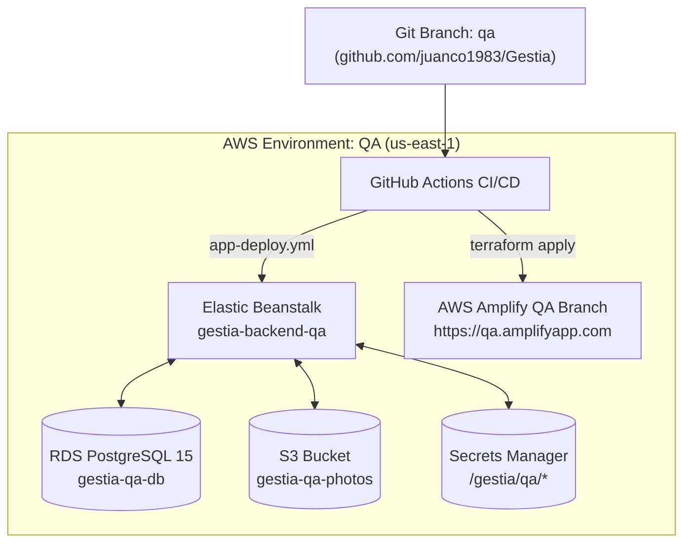

# Plan de Infraestructura: Entorno QA y Evaluación de Eficiencia (AWS)

## 📌 1. Objetivo y Alcance
Establecer un entorno de **Calidad y Aseguramiento (QA)** aislado en AWS (`gestia-qa-backend`, `gestia-qa-db`, `gestia-qa-photos`), crear la rama de Git **`qa`** en GitHub, y actualizar la canalización CI/CD (`.github/workflows/app-deploy.yml` y `terraform-apply.yml`) para permitir despliegues automáticos e independientes en la rama `qa`.

---

## 📊 2. Evaluación de Eficiencia del Despliegue Actual vs. Alternativas

### A. Diagnóstico de la Arquitectura Actual (Elastic Beanstalk + Amplify + RDS)
Actualmente, el backend de la aplicación se despliega mediante **AWS Elastic Beanstalk (EC2 `t3.micro` AL2023)** y la base de datos corre en **AWS RDS PostgreSQL 15 (`db.t3.micro`)**.

- **Puntos Fortes**:
  - Muy bajo costo en Free Tier (~$15-$25/mes por ambiente).
  - Manejo transparente de Nginx, variables de entorno y certificados CloudFront HTTPS.
- **Inconvenientes / Cuellos de Botella de Eficiencia**:
  1. **Velocidad de Deploy**: Elastic Beanstalk toma entre 5 a 8 minutos por actualización debido a la reinicialización de la instancia EC2 y Nginx.
  2. **Script de Inicialización en DB**: El `Procfile` actual ejecuta `prisma db push --accept-data-loss` en el arranque del servidor, lo que genera riesgo de alteración de esquema si se ejecuta sin control.
  3. **Límite de Memoria (`t3.micro`)**: Las instancias EC2 de 1GB de RAM sufren presión de memoria si se compila en servidor (aliviado actualmente con swap de 2GB y builds en GitHub Actions).

### B. Alternativa de Mayor Eficiencia a Futuro: AWS App Runner / ECS Fargate (Docker)
Para proyectos en crecimiento, migrar el backend a **AWS App Runner** o **ECS Fargate**:
- **Ventaja 1**: Despliegue ultrasensible mediante imágenes Docker compiladas previamente en ECR (tiempos de deploy < 2 minutos).
- **Ventaja 2**: Auto-scaling verdadero (puede escalar a 0 en horarios fuera de oficina, reduciendo costos).
- **Ventaja 3**: Aislamiento 100% libre de parches de OS o dependencias de plataforma AL2023.

---

## 🏗️ 3. Propuesta de Arquitectura e Infraestructura para Entorno QA

Para el entorno **QA**, utilizaremos la arquitectura modular de Terraform (`infra/environments/qa`), manteniendo paridad 1:1 con `dev` y `prod`:

---

## 📝 4. Plan de Ejecución (Desglose de Tareas)

### Fase 1: Control de Versiones (Git)
- [ ] Crear la rama `qa` a partir de `dev`: `git checkout -b qa`
- [ ] Realizar `git push origin qa` para publicar la rama en GitHub.

### Fase 2: Infraestructura como Código (Terraform `infra/environments/qa`)
- [ ] Crear directorio `infra/environments/qa/` clonando la configuración modular de `dev`.
- [ ] Definir `main.tf`, `variables.tf` y `outputs.tf` con sufijo `qa` (`env = "qa"`).
- [ ] Configurar el backend remoto S3 de estado: `key = "qa/terraform.tfstate"`.

### Fase 3: CI/CD Pipelines (`.github/workflows/`)
- [ ] Modificar `.github/workflows/app-deploy.yml`:
  - Agregar `qa` a las ramas del trigger `push`.
  - Configurar mapeo de ambiente: `github.ref_name == 'qa' -> gestia-backend-qa`.
- [ ] Modificar `.github/workflows/terraform-apply.yml`:
  - Agregar trigger y directorio `infra/environments/qa`.

### Fase 4: Optimización del Despliegue y Migración de BD
- [ ] Reemplazar `prisma db push --accept-data-loss` por `prisma migrate deploy` en el `Procfile` de QA/Prod para proteger la integridad de los datos.

---

## 🔒 5. Criterios de Aceptación y Verificación
1. **GitHub**: Existe la rama `qa` publicada en `github.com/juanco1983/Gestia`.
2. **Terraform**: La infraestructura de QA se despliega sin errores vía `terraform apply`.
3. **App Deploy**: Al realizar un push a `qa`, GitHub Actions compila el paquete y actualiza `gestia-backend-qa` en AWS.
4. **Health Check**: El endpoint `/health` en `gestia-backend-qa` responde HTTP 200 OK con conexión activa a Postgres QA.

---

## 🏛️ 6. Mejores Prácticas AWS: Estrategia Multi-Cuenta (AWS Organizations)

> **Recomendación de Arquitectura de Seguridad**: En AWS Well-Architected Framework, separar entornos por **Cuentas AWS Independientes** (`Dev Account`, `QA Account`, `Prod Account`) es la mejor práctica recomendada frente a usar una única cuenta con nombres/etiquetas.

### Beneficios del Aislamiento por Cuentas:
1. **Radio de Impacto Cero (Blast Radius)**: Un error en un despliegue o comando de destrucción (`terraform destroy` o `db:wipe`) en `dev` o `qa` **jamás** afectará la infraestructura ni los datos de Producción.
2. **Límites de Servicio Aislados (Service Quotas)**: Evita que el consumo intensivo de APIs, BD o vCPUs en QA bloquee las cuotas de Producción.
3. **Facturación Transparente**: Facturación unificada vía **AWS Organizations (Consolidated Billing)** manteniendo la visibilidad exacta de costos por cada cuenta/entorno.
4. **Seguridad IAM estricta**: Los roles OIDC de GitHub Actions solo pueden asumir la cuenta correspondiente al branch (`dev` ➔ Cuenta Dev, `qa` ➔ Cuenta QA, `main` ➔ Cuenta Prod).
