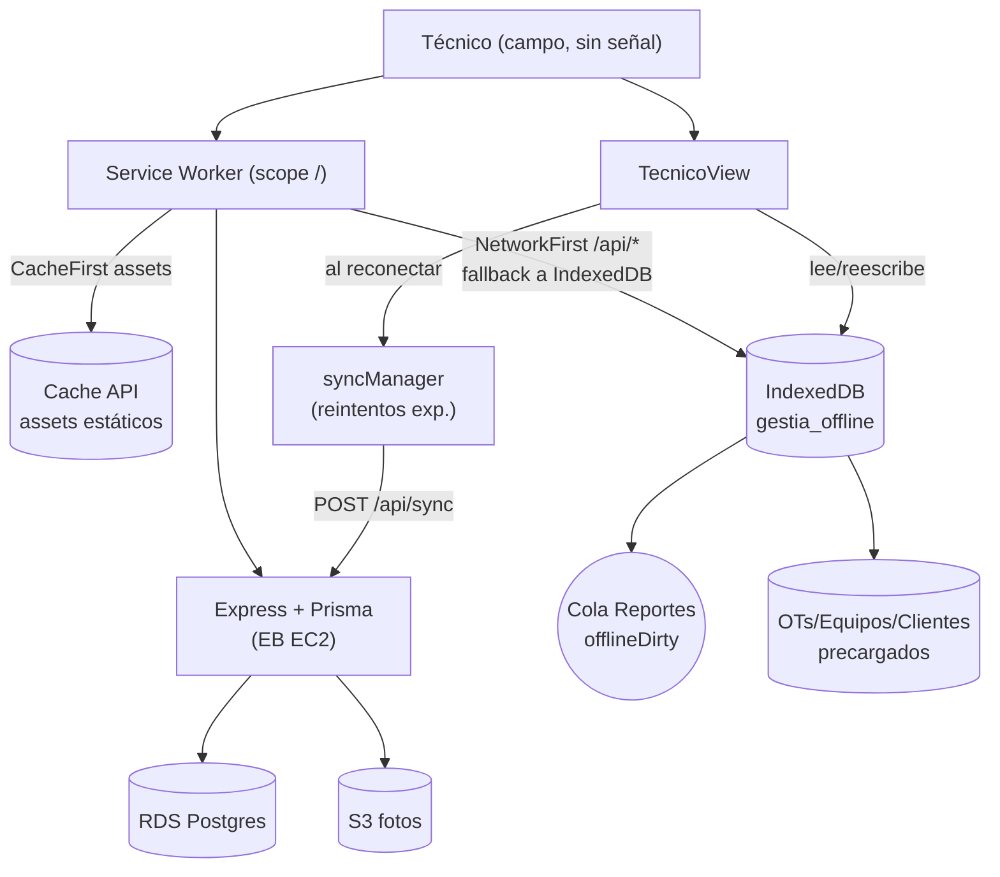

# Plan + Spec PWA — Módulo Técnico Offline

**Tipo:** Infra / Frontend
**Fecha:** 2026-08-07
**Estado:** Implementable (aprobado por el usuario; ADR: `Documentacion/ADR/ADR-001-pwa-tecnico-offline.md`)
**Documento canónico de diseño:** `Documentacion/Guias y Estandares/guia_ui_ux.md` (patrón Dashboard)

---

## 📌 1. Contexto y Problema
El módulo de Técnico es el único rol que opera en campo sin internet estable (sótanos,
cuartos eléctricos, planta, zonas rurales). Hoy Gestia funciona como web app pura:

- Estado de conexión: `navigator.onLine` en `App.tsx:188`.
- Borradores del wizard: `localStorage` con key `mafort_draft_<otId>_<equipoId>`
  (`TecnicoView.tsx:341,412,464`, `WizardInforme.tsx:82`).
- Reportes offline: `report.offlineDirty = true` + `onSaveReportOffline()` que encola
  (`TecnicoView.tsx:904-943`).
- Sync al reconectar: existe `POST /api/sync` (`server.ts:1293`) que acepta
  `{reports, ots, visitas, clients, contracts, ordenesTrabajo, contratosNuevos, users, logs}`.

**Carencias actuales:**
1. Borradores en `localStorage` → si el técnico cierra/refresca el navegador en sitio sin
   señal, los datos **quedan atrapados en ese dispositivo** sin mecanismo de exportación.
2. `localStorage` tiene límite ~5MB → las **fotos en Base64** (ya comprimidas en
   `compressBase64Image`) saturan la cuota y el guardado falla silenciosamente.
3. No hay **precarga** de OTs/equipos/clientes del día → el técnico no puede abrir la
   ficha de una OT si entró a la app sin internet.
4. No hay **instalabilidad** → el técnico debe teclear la URL cada vez, y el browser
   recarga la SPA perdiendo el contexto offline.
5. La cola actual depende de `isOnline` reactivo + un solo intento de envío; no hay
   **reintentos exponenciales** ni persistencia entre sesiones.

**Decisión del usuario:** PWA con escritura offline **solo para el módulo Técnico**. El
resto del sistema (Ventas, Supervisor, Administración, Cliente, Dashboard, Monitoreo)
sigue online tal cual.

---

## 🎯 2. Alcance

### Dentro
- Geolocalización como app instalable (manifest) — opcionalmente para toda Gestia, pero
  **las capacidades offline (serviceworker caching + IndexedDB) se scopean al portal de Técnico**.
- Service Worker con cacheo selectivo (solo assets y rutas que usa el técnico).
- Base local persistente en **IndexedDB** (NO localStorage) para:
  - OTs asignadas al técnico (precargadas al login).
  - Equipos, clientes y contratos asociados (precargados).
  - Cola de reportes `offlineDirty` con reintentos.
  - Borradores del wizard (migración de `localStorage` → IndexedDB).
- Migración del patrón `mafort_draft_*` de localStorage a IndexedDB (con fallback de
  lectura de localStorage viejo para no perder borradores vigentes).
- Indicadores UI en `TecnicoView`: badge Offline/Online actual más **cola de sincronización
  visible** (nº pendientes, último sync, reintentos) según `guia_ui_ux.md §5`.
- Extender el `POST /api/sync` existente para aceptar `draftReports` (no finalizados) y
  `equipoCaracteristicasOverride` (datos del equipo tomados en campo).

### Fuera
- Offline para roles != Técnico.
- Native app (React Native / Flutter / dos codebases). **Descartado** por costo/beneficio;
  el componente actual ya hace el flujo, solo necesita persistencia robusta.
- Background sync nativo del browser (permisos complejos). Se usará un sync en
  foreground al reconectar + `visibilitychange`/`online` events.

---

## 🏗️ 3. Arquitectura



### 3.1 Service Worker (Vite)
- **Stack:** `vite-plugin-pwa` (`@vitejsjs/vite-plugin-pwa` ya compatible con Vite 6 / React 19).
- **Registro:** solo en `src/main.tsx` (o `App.tsx`) protegido por feature flag
  `import.meta.env.VITE_PWA_TECNICO === '1'` para no afectar otros entornos hasta estabilizar.
- **Estrategias:**
  - Assets estáticos (`index.html`, JS, CSS, fuentes Google, lucide, recharts):
    **CacheFirst** con expiración.
  - `/api/*` (cualquier método): **NetworkFirst** con fallback a IndexedDB para GET
    (`GET /api/ots`, `/api/equipos/:id`, `/api/clients/:id`). Para POST/PUT que fallen online
    → encolar en IndexedDB con `offlineDirty=true`.
- **Scope offline selectivo:** plantilla de búsqueda de rutas por nombre de módulo no
  aplica (no hay React Router); el SW cachea los assets globales que TODOS usan, pero las
  rutas `/api/*` quedan en passthrough online excepto las que el técnico necesita
  (allowlist en `runtimeCache`):
  - `GET /api/ots?tecnico=...` (hoy el endpoint no filtra; spec: agregar query opcional).
  - `GET /api/equipos/:id`
  - `GET /api/clients/:id`
  - `POST /api/sync`

### 3.2 IndexedDB — libs y schema
- **Lib:** `idb` (pequeña, sin dependencias, types nativos). Alternativa: Dexie (más
  opinión). **Recomendado: `idb`** por mínima superficie.
- **DB name:** `gestia_offline`
- **Stores:**
  | Store | PK | Indexes | Uso |
  |---|---|---|---|
  | `drafts` | `key` (string `${otId}__${equipoId}`) | `updatedAt` | Borradores del wizard |
  | `reports_queue` | `queueId` (uuid) | `otId`, `equipoId`, `createdAt`, `attempts`, `status` | Cola de reportes finalizados offline |
  | `ots` | `id` | `tecnicoTitularId`, `estado`, `fechaProgramada` | Precarga de OTs del día |
  | `equipos` | `id` | `clienteId`, `contratoId` | Equipos asociados |
  | `clientes` | `id` | — | Clientes asociados |
  | `meta` | `key` | — | `lastSyncAt`, `userId`, `swVersion` |

### 3.3 Precarga al login (con internet)
Cuando el técnico inicia sesión (`login.ts` helper en browser, equivalente funcional en
`src/components/LoginView.tsx`), una vez autenticado como rol Técnico se dispara
`preloadOfflineData()`:
1. `GET /api/ots?tecnicoTitularId={userId}&fecha={hoy..+7d}` → IndexedDB `ots`.
2. Para cada OT, `GET /api/equipos/:id` (su `equipoId` split por `,`) → `equipos`.
3. `GET /api/clients/:id` (su `clientId`) → `clientes`.
4. Marca `meta.lastSyncAt = now`.
Si falla (sin internet en login), el técnico opera con lo que tenga cacheado de sesiones
previas. Se muestra mensaje informativo vía `<ToastModal type="offline">`.

### 3.4 Escritura offline del wizard
- Sustituir las llamadas a `localStorage.setItem('mafort_draft_…')` por
  `idb.put('drafts', {...})` en `WizardInforme.tsx` (líneas 82, 119-142) y
  `TecnicoView.tsx` (341, 412, 464, 920, 942, 1288).
- Al `onComplete`/`handleSubmit` con `!isOnline`:
  - Generar `queueId = crypto.randomUUID()` y `status='pending'`, `attempts=0`.
  - `idb.put('reports_queue', compiledReport)` con `offlineDirty=true`.
  - `notifyOffline('Reporte Cacheado Localmente', 'Se encoló en este dispositivo y se enviará al reconectar.')`.
- **Migración legacy:** al abrir IndexedDB por primera vez, leer las keys
  `localStorage['mafort_draft_*']` y `localStorage['mafort_wizard_draft_*']`, insertarlas
  en `drafts`, y **borrar** las keys de localStorage (solo si la inserción fue OK).

### 3.5 Sync al reconectar
- Listener `window.addEventListener('online', flushQueue)` + `document` `visibilitychange`.
- `flushQueue()`:
  1. Lee `reports_queue where status in ('pending','failed')` ordenado por `createdAt`.
  2. Para cada item, `POST /api/sync { reports: [item] }`.
  3. Si 200 → `status='synced'`, `idb.delete` (o marcar `syncedAt`).
  4. Si error → `attempts++`, `nextRetryAt = now + backoff(attempts)` (exp: 5s, 15s, 60s, 5min, 15min, cap 30min).
  5. Actualiza UI (`colaPendientes`, `ultimoSyncAt`) que lee de `meta`.
- **Conflicto de estado OT:** `/api/sync` ya protege estados avanzados (líneas 1351-1356).
  El cliente NO debe sobreescribir una OT que pasó a Aprobada/Firmada en servidor; el SW
  re-carga el estado real tras un sync exitoso y notifica si la OT avanzó.

### 3.6 UI / Estados a homologar (guia_ui_ux.md)
- **Header card de TecnicoView** ya muestra "Conectado"/"Offline" (`TecnicoView.tsx:2271`).
  Se agrega un **chip de cola** estilo `guia_ui_ux.md §4.5`:
  ```
  <span className="inline-flex items-center gap-1.5 px-3 py-1.5 bg-amber-50 border
                   border-amber-200/80 rounded-xl text-xs font-bold font-mono
                   text-amber-700">3 reportes en cola · último sync hace 12 min</span>
  ```
- Estado vacío: "Sin reportes pendientes de sincronización" (emerald).
- Estado error crítico: "No se pudo enviar el reporte #X. Reintentaremos automáticamente.
  [Reintentar ahora] [Ver detalles]" — botones `btn-primary` / `btn-secondary` de `§4.1`.
- **Prohibido `window.alert`** — todo sigue el patrón `<ToastModal>` (`§5`).

### 3.7 Backend (server.ts)
- Agregar `GET /api/ots?tecnicoTitularId=...&fechaDesde=...&fechaHasta=...` (hoy no filtra).
- Extender `POST /api/sync` para aceptar `draftReports` (opcional) y devolver
  `appliedIds[]` + `conflicts[{otId, serverEstado}]`.
- No requiere migración de `prisma/schema.prisma` (campos ya existen: `offlineDirty` en
  `TechnicalReport`, `equipoId` en `OT`).

---

## ✅ 4. Criterios de Aceptación
- [ ] El técnico puede **instalar** Gestia en su dispositivo ("Add to Home Screen").
- [ ] Offline, el técnico abre la app, ve sus OTs del día (precargadas) y el wizard del
      informe funciona sin internet (incluido subir fotos desde la galería/cámara).
- [ ] Al cerrar y reabrir el browser sin internet, los borradores **persisten** (IndexedDB).
- [ ] No se pierde ningún `localStorage['mafort_draft_*']` legacy (migración).
- [ ] 50 fotos comprimidas (~80KB c/u) caben sin saturar cuota (IndexedDB >> localStorage).
- [ ] Al reconectar, los reportes encolados se envían automáticamente con reintentos
      exponenciales; la UI muestra la cola y `último sync`.
- [ ] Los demás roles no notan cambios (sin SW intrusivo en ITS rutas/online).
- [ ] E2E Playwright con `context.setOffline(true)` simula offline → pasa.
- [ ] No se introducen `window.alert`, tokens fuera de la guía, ni librerías UI extrañas.

---

## 🧱 5. Desglose de Tareas (incremental)

| # | Tarea | Archivos | Estado |
|---|---|---|---|
| 1 | ADR PWA en `Documentacion/` + plan (este doc) | `Documentacion/ADR/ADR-001-pwa-tecnico-offline.md` | completed |
| 2 | Mockup estados offline (cola + indicadores) en `Documentacion/mockups/pwa-tecnico-offline.html` | mockup | completed |
| 3 | Instalar `vite-plugin-pwa` + `idb`; configurar `VITE_PWA_TECNICO` flag | `package.json`, `vite.config.ts` | completed |
| 4 | Service Worker con estrategias (CacheFirst assets, NetworkFirst allowlist `/api/*`) | `src/sw.ts` (registro vía `injectRegister: auto`) | completed |
| 5 | Capa IndexedDB (`src/offline/db.ts` stores + `src/offline/sync.ts`) | nuevos | completed |
| 6 | Migrar drafts localStorage→IndexedDB en `WizardInforme` + `TecnicoView` | `WizardInforme.tsx`, `TecnicoView.tsx` | completed |
| 7 | `preloadOfflineData()` al login como Técnico | `src/offline/preload.ts`, `App.tsx` | completed |
| 8 | UI cola de sincronización en `TecnicoView` (chip + panel) | `TecnicoView.tsx` | completed |
| 9 | Extender `POST /api/sync` + `GET /api/ots?tecnico=…` | `server.ts` | completed |
| 10 | Playwright con `setOffline(true)` + flujo offline→online | `tests/pwa-tecnico-offline.spec.ts` | completed |
| 11 | QA gate (`qa-engineer`) + evidencia video `setOffline` | `Documentacion/evidencias/` | completed |

---

## 📦 6. Dependencias nuevas

| Paquete | Motivo | Peso aprox |
|---|---|---|
| `vite-plugin-pwa` | SW + manifest + auto-update | ~30KB build |
| `idb` | Wrapper IndexedDB tipado | ~1KB gz |

**No se introducen:** React Router (prohibido por ADR actual), Workbox CLI suelto (lo trae el plugin), Dexie (prefiero `idb`), `sonner`/toast libs (prohibido por `§5`).

---

## 🔒 7. Riesgos y Mitigaciones

| Riesgo | Mitigación |
|---|---|
| SW stale en caches de técnicos viejos | `vite-plugin-pwa` auto-update + aviso "Nueva versión disponible" vía ToastModal |
| IndexedDB cuota excedida (fotos) | `navigator.storage.estimate()` + limpiezas tras sync exitosa; comprimir antes (ya existe `compressBase64Image`) |
| Conflicto OT (servidor avanzó a Aprobada mientras técnico enviaba informe offline) | `/api/sync` ya protege estados avanzados; UI notifica y actualiza estado local |
| Login sin internet en primera vez (precarga imposible) | Mensaje claro: "Funciona con datos cacheados de la última sesión. Algunos datos pueden no estar disponibles." |
| SW注册 falla en browser sin HTTPS (localhost dev) | Plugin habilita `devOptions.disabled` en dev local; en prod Amplify/CF ya es HTTPS |

---

## 🧪 8. Verificación (qa-engineer)

- `npm run lint` limpio.
- `npm run build` genera `dist/` con SW + manifest.
- E2E Playwright `tests/pwa-tecnico-offline.spec.ts`:
  1. Login técnico con internet → precarga visible (meta.lastSyncAt actualizado).
  2. `context.setOffline(true)` → abrir OT → wizard paso 6 → guardar informe offline.
  3. Cerrar/reabrir context → borrador persiste.
  4. `setOffline(false)` → cola se sincroniza, OT pasa a "Sometido a Revisión".
- Suite existente (`integration-suite`, `tecnico-ui-redesign`, `wizard-precarga-caracteristicas`)
  sigue pasando (sin regresiones).

---

## 📎 9. Referencias
- `Documentacion/guia_ui_ux.md` §4 (badges), §5 (ToastModal patrón canónico).
- `Documentacion/arquitectura_infraestructura_nube.md` (topología AWS, HTTPS por CF).
- `server.ts:1293` `POST /api/sync` (extensible).
- `src/components/TecnicoView.tsx:904-943` patrón offline actual.
- `src/utils/imageCompressor.ts` compresión ya existente (reutilizable).